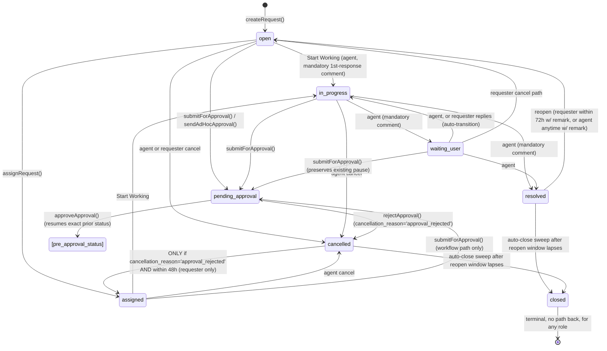
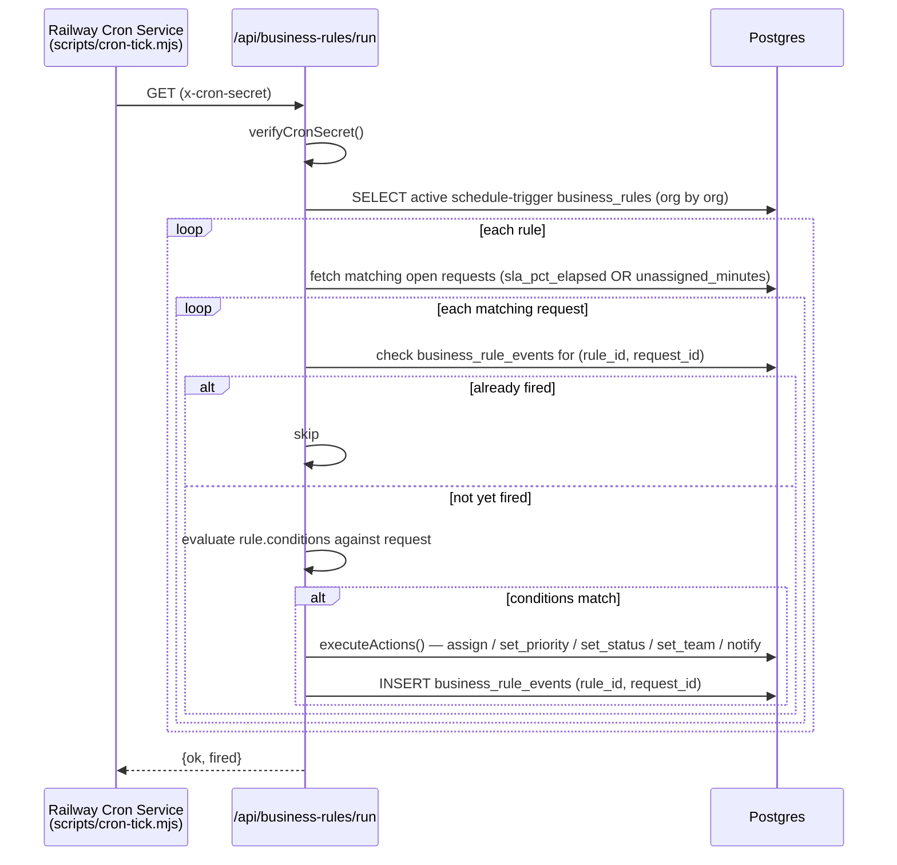
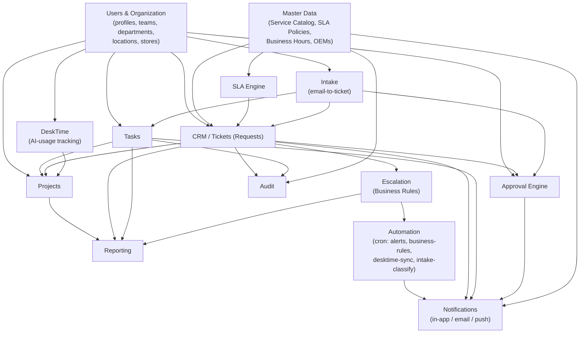

# CITYKART DESK — SYSTEM AUDIT & KNOWLEDGE TRANSFER REPORT

**Audit date:** 2026-09-09
**Method:** Direct, read-only inspection of the repository (`C:\Users\Administrator\Desktop\AI WORK\Zoho Alternate`) — all 131 Supabase migrations, ~90 server actions, 43 pages, admin action files, SLA/escalation/approval engines, notification/push pipeline, intake email-to-ticket module, reporting/DeskTime/export code, and RBAC — cross-checked against three prior internal audits (`docs/AUDIT-2026-08-08.md`, `docs/PERF-AUDIT.md`, `.claude/uat/*`) and `HANDOVER.md`, with every prior claim independently re-verified against **current** on-disk code (including uncommitted working-tree changes present at audit time).
**Conventions used throughout:** `CONFIRMED` = verified directly from code/migration text. `INFERRED` = strongly implied by code/comments but not exhaustively traced end-to-end. `UNCONFIRMED` = could not be established from static reading alone (flagged explicitly, never guessed). `POTENTIAL DEFECT` = implementation appears to diverge from what a reasonable business/technical expectation would be. No code was changed in producing this report.

---

## 1. Executive Summary

Citykart DESK is a full internal ITSM / service-desk platform — tickets ("requests"), tasks, projects, multi-step approvals, a business-rules automation/escalation engine, business-hours-aware SLAs, a multi-channel notification system (in-app, email, Web Push), a self-service knowledge base, an email-to-ticket "Intake" pipeline (Gmail/Outlook OAuth + LLM classification), and a DeskTime-based AI-tool-usage tracker — built on Next.js 16 (App Router, Server Actions) and Supabase (Postgres + Auth + Storage + Vault), deployed as a Docker container on Railway.

**Origin and current tenancy shape.** The codebase was originally built as a multi-tenant SaaS template ("CognixDesk"/"FlowDesk") and was later rebranded and stripped down for Citykart's own in-house use (`docs/ARCHITECTURE.md §0`, `HANDOVER.md §1`). The multi-tenancy machinery (`organizations`, `org_id` on nearly every table, `current_org_id()` RLS helper) was **kept, not removed** — there is exactly one seeded organization row today, but every table, RLS policy, and admin action still operates in terms of `org_id`. This matters for two reasons documented throughout this report: (a) it is why the codebase is unusually well-isolated per-tenant even though only one tenant exists, and (b) it is why several "config" tables added later (`business_hours`, `holidays`, `task_statuses`, `task_priorities`, `request_priorities`, `retention_policies`, `app_settings`) were built **without** an `org_id` column at all — a deliberate simplification under single-tenant assumptions that would become a real cross-tenant leak the moment a second organization is provisioned (§12 db-schema findings, §21).

**Scale and pace of change.** The `supabase/migrations/` directory contains 131 migrations; five of the newest (127–131) were still uncommitted in git at audit time, alongside substantial uncommitted changes to `lib/actions/requests.ts` (+192 lines), `lib/notifications.ts` (+139/-?), `lib/actions/admin/org.ts` (+182 lines), and others. The product has grown fast: a **Store Master + OEM Vendor Auto-Routing** system (physical stores, vendor records, auto-email-and-status-flip ticket routing for a named "AC Issues Support" scenario), an admin-configurable **Notification Rules** matrix, and a full **Web Push** subsystem were all added in the days immediately preceding this audit and are documented here for the first time — neither `docs/ARCHITECTURE.md` nor `docs/DATABASE.md` mention any of it, nor do they mention the entire 13-migration **Intake** (email-to-ticket) module, the **Projects/Milestones** module, or **DeskTime** integration, despite all three being fully built, wired, and in active use.

**Overall engineering posture: materially better than a first read of the two prior in-repo audits would suggest.** `docs/AUDIT-2026-08-08.md` (a six-track audit) found a "consistent, repeated authorization gap" pattern across the app. Re-verifying every one of its ~30 named findings against current code (§25, §26) shows the large majority are now **FIXED** — including all of the historically Critical items (cross-tenant RLS leaks, the Projects-module org-wide-read hole, the `submitForApproval` TOCTOU race, the SLA minute-by-minute performance bug, the cron-route auth gaps, the Knowledge Base content-wipe bug, and the stale approval-workflow-steps bug). A handful of real gaps remain open and are catalogued precisely in §25–26, and — importantly — this pass surfaced **new, previously-unflagged findings** of the same "checked I'm logged in, not that I'm allowed" class in code these prior audits never reached (`lib/actions/analytics.ts`'s `getFilteredRequests`/`getFilteredTasks`, `lib/actions/knowledge-base.ts`'s org-resolution bug, `lib/actions/tasks.ts`'s `deleteTask` omitting `platform_owner`).

**The single most consequential structural finding** is that the codebase has, on close inspection, **two materially misleading or duplicated systems that a new engineering team must know about before touching either**:
1. **`custom_roles`/`permission_overrides` (the "Roles & Permissions" admin screen's Permission Matrix editor) is fully built, RLS-protected, and writes real rows — but nothing in the entire codebase ever reads either table to make an authorization decision.** Every real permission check anywhere in the app is a hard-coded `profile.role` comparison. An admin who edits this screen believes they have changed access control; they have not (§6, §22 BR catalogue, §25).
2. **Two independent implementations of the request status-change state machine exist and must be hand-kept in sync**: `updateRequestStatus()` (interactive, `lib/actions/requests.ts`) and `runSetStatus()` (Business-Rules-engine-driven, `lib/rules/actions.ts`). Both correctly replicate SLA pause/resume, reopen-window, CSAT-survey, and time-tracking bookkeeping today — but every future change to one must be manually mirrored to the other, and there is no shared helper (§9, §22, §24).

Additionally, "SLA Breached" — arguably the single most important KPI in an ITSM tool — is computed **three functionally different ways** in three different parts of the app with no UI text anywhere explaining why the numbers won't match (§10, §19, §25 finding). The application has **no automated test suite and no CI/CD pipeline of any kind** (§24) — every fix and every regression check documented in this report's source material (three prior audits, this one) was performed by manual/AI-assisted static code review, not by a test harness.

The remainder of this report documents every module, every table, every server action, every automation, and every business rule with file:line evidence, in the exact structure requested, closing with a Handoff Pack summarizing the above for a new engineering owner.

---

## 2. Technology Stack

| # | Layer | Choice | Evidence |
|---|---|---|---|
| 1 | Frontend framework | Next.js **16.2.9**, App Router, React Server Components + Server Actions, React **19.2.4** | `package.json:24-26` |
| 2 | Backend framework | Same Next.js app (Server Actions + `app/api/**` route handlers) **plus** a separate standalone Express/Node worker (`api/` directory) dedicated to the Intake email pipeline | `package.json`; `api/Dockerfile`; `docs/RAILWAY-DEPLOYMENT.md` |
| 3 | Languages | TypeScript throughout (app + worker); SQL (131 Postgres migrations) | `tsconfig.json`; `supabase/migrations/**` |
| 4 | Database | PostgreSQL via Supabase (Postgres + Auth + Storage + Vault), run locally via Supabase CLI/Docker for dev, hosted Supabase project for production per `docs/RAILWAY-DEPLOYMENT.md` | `supabase/config.toml`; `docs/RAILWAY-DEPLOYMENT.md` |
| 5 | ORM / query layer | No traditional ORM — `@supabase/supabase-js` (PostgREST) for almost all reads/writes, plus a set of hand-written `SECURITY DEFINER` SQL RPCs for atomic/cross-cutting operations (`generate_request_no`, `get_home_dashboard`, `merge_request_form_data`, `upsert_field_sla_override`, `owner_delete_org`, `retag_service_categories`, `retag_service_locations`, `intake_store_credential`/`intake_read_credential`, `org_store_desktime_key`/`org_read_desktime_key`) | `supabase/migrations/**`; §14 |
| 6 | Auth | Supabase Auth (GoTrue); session refresh happens in `proxy.ts` (**not** `middleware.ts` — a deliberate project convention, `docs/ARCHITECTURE.md §0`) via `getClaims()`/`getUser()` | `proxy.ts:1-115` |
| 7 | Authorization | `profiles.role` enum (5 fixed values) + `org_id` scoping, enforced redundantly at (a) server-action role/ownership checks and (b) Postgres RLS policies (`current_user_role()`/`current_org_id()` SECURITY DEFINER helpers). A DB-backed "custom roles / permission overrides" system exists but is **not wired to any enforcement path** — see §6, §25. | Throughout; `lib/constants/roles.ts`; migration `20240101000039` |
| 8 | Hosting / deployment | Railway, Docker container built via a 3-stage Alpine `Dockerfile` (`output: 'standalone'`), health-checked at `/api/health`; separate Railway "cron" service(s) run `scripts/cron-tick.mjs` on a schedule | `Dockerfile`; `railway.toml`; `docs/RAILWAY-DEPLOYMENT.md` |
| 9 | Environment / config | `.env.local` (gitignored) / `.env.example` (~40 documented vars spanning Supabase, cron, email, intake worker, intake LLM, intake OAuth) | `.env.example` |
| 10 | File / storage system | Supabase Storage buckets: `request-attachments` (private, 25MB, MIME-allowlisted, signed URLs), `task-attachments` (same), `intake-attachments` (private, worker-managed), `icons` (public, 5MB, admin-uploaded catalog icons), `avatars` (public) | `supabase/migrations/20240101000003`, `20240101000030`, `20240101000111`; `lib/actions/attachments.ts`, `profile.ts` |
| 11 | Email | **Resend** HTTP API, gated `EMAIL_ENABLED = !!RESEND_API_KEY` (silently disabled if unset) | `lib/email/send.ts:12`; `lib/email/config.ts:5` |
| 12 | SMS / WhatsApp | **None found** anywhere in the codebase | Grep across `lib/`, `app/` |
| 13 | Push notifications | Web Push (VAPID protocol) via the `web-push` npm package, service worker at `public/sw.js`, gated `PUSH_ENABLED = !!VAPID_PUBLIC_KEY && !!VAPID_PRIVATE_KEY` | `lib/push/send.ts:6`; `public/sw.js`; migration `20240101000129` |
| 14 | Cron / scheduled jobs | No database-level scheduler (`pg_cron`/`cron.schedule` — zero matches anywhere in `supabase/migrations/`). Entirely **external HTTP-triggered**: `scripts/cron-tick.mjs` (a small Node script meant to run as its own Railway "cron service") calls 4 authenticated GET endpoints on a schedule the operator configures per job. See §17. | `scripts/cron-tick.mjs`; `lib/cron-auth.ts`; §17 |
| 15 | Realtime / websocket | **No evidence of any Supabase Realtime subscription or WebSocket channel** was found in any of the ~90 server actions, ~43 pages, or component files inspected across this audit's 12 research passes. `UNCONFIRMED` as an absolute negative (not every client component line was read), but no agent tasked with reviewing the relevant surfaces (requests/tasks/notifications/intake) reported one. | Absence of evidence across all passes |
| 16 | External integrations | Resend (email) · Web Push services (browser-vendor push, e.g. FCM/Mozilla) · DeskTime (3rd-party time-tracking API, read-only pull) · Google Gmail API + Cloud Pub/Sub (Intake push ingestion) · Microsoft Graph API (Intake push ingestion, Outlook/M365) · an OpenAI-chat-completions-compatible LLM provider (Intake Stage-2 classification, defaults to Groq `llama-3.3-70b-versatile`) · Supabase Vault (credential storage for DeskTime API key + Intake mailbox OAuth tokens) | §13 (Intake), §9c (DeskTime) |
| 17 | Analytics / reporting libraries | In-house (`lib/reporting/pivot-engine.ts` — a pure, framework-free pivot computation engine; `lib/reporting/field-registry.ts`); `exceljs` for native multi-sheet XLSX export with styling/native Excel Tables | `package.json:22`; `lib/actions/reportExport.ts`; §19 |
| 18 | UI component libraries | shadcn/ui on `@base-ui/react` primitives, `lucide-react` icons, `@dnd-kit/*` (drag-and-drop board views), `sonner` (toasts), `react-hook-form` + `zod` (forms/validation) | `package.json:13-32` |
| 19 | State management | No client-side global-state library (no Redux/Zustand/Jotai). Server Components + Server Actions is the primary data-flow pattern; `React.cache()` used for per-request memoization of hot reads (`getCurrentProfile`, `getEnabledModules`, SLA calendar lookups); URL search params used as state for several (not all — see §20 finding) filter/tab UIs. | `docs/ARCHITECTURE.md §4`; multiple query files |
| 20 | Logging / error monitoring | `lib/monitoring.ts` is a **console-only stub** — `captureException`/`captureMessage` just `console.error`/`console.log`, with an explicit `TODO: replace with Sentry.captureException` comment; no `@sentry/*` package is installed. Client-side crash/feedback reports are separately captured into an `error_reports` Postgres table (`lib/error-reporting.ts`). `/api/health` provides a DB-connectivity/latency probe for uptime monitors. | `lib/monitoring.ts:1-30`; `package.json` (no sentry dep) |
| 21 | Testing framework | **None found.** A repo-wide search for `*.test.*`/`*.spec.*` under `app/`, `lib/`, `components/`, `types/` returns **zero files**. No Jest/Vitest/Playwright/Cypress config or dependency exists anywhere in `package.json`. | Direct search, this audit |
| 22 | CI/CD | **None found.** No `.github/workflows/` directory exists in the repository. `HANDOVER.md`/`docs/AUDIT-2026-08-08.md` both note `next.config.ts` disables build-time type checking (`ignoreBuildErrors: true`, `ignoreDuringBuilds: true`) as a deliberate choice, with CI (if any existed) as the only backstop — confirmed there is none. | Direct search; `next.config.ts` |

---

## 3. Architecture

### 3.1 High-level component diagram

```mermaid
flowchart TB
    subgraph Client["Browser"]
        UI["Next.js Client Components<br/>(React 19, shadcn/ui)"]
        SW["Service Worker<br/>public/sw.js (Web Push)"]
    end

    subgraph NextApp["Next.js 16 App (Railway container)"]
        Proxy["proxy.ts (Edge)<br/>session refresh + auth redirect + PUBLIC_API_ROUTES allowlist"]
        Pages["App Router Pages<br/>(app)/**, (auth)/**, RSC"]
        Actions["Server Actions<br/>lib/actions/**"]
        Queries["Read layer<br/>lib/queries/**"]
        Rules["Business Rules Engine<br/>lib/rules/**"]
        SLA["SLA Engine<br/>lib/sla/**"]
        Notify["Notification Pipeline<br/>lib/notifications.ts, lib/email/**, lib/push/**"]
        APIRoutes["app/api/** route handlers<br/>(health, business-rules/run, alerts/run,<br/>desktime/sync, intake/*, admin/audit)"]
    end

    subgraph Supabase["Supabase Project"]
        PG[("Postgres 131 migrations<br/>RLS policies, SECURITY DEFINER RPCs")]
        Auth["Supabase Auth (GoTrue)"]
        Storage["Storage buckets<br/>request/task-attachments, icons, avatars, intake-attachments"]
        Vault["Vault<br/>DeskTime API key, Intake OAuth credentials"]
    end

    subgraph CronSvc["Railway Cron Service(s)"]
        Tick["scripts/cron-tick.mjs<br/>alerts / business-rules / desktime-sync / intake-classify"]
    end

    subgraph IntakeWorker["Separate Express Worker (Railway)"]
        Worker["api/src/intake/**<br/>IMAP poll, Gmail/Graph sync, MIME parse,<br/>rule+LLM classification, SMTP send"]
    end

    subgraph External["External Services"]
        Resend["Resend (email)"]
        PushSvc["Browser push services<br/>(FCM, Mozilla, ...)"]
        DeskTimeAPI["DeskTime API"]
        GmailAPI["Gmail API + Cloud Pub/Sub"]
        GraphAPI["Microsoft Graph API"]
        LLM["LLM provider<br/>(Groq-compatible)"]
    end

    UI -->|Server Actions / RSC fetch| Pages
    Pages --> Proxy
    Pages --> Actions
    Pages --> Queries
    Actions --> Rules
    Actions --> SLA
    Actions --> Notify
    Actions --> PG
    Queries --> PG
    Rules --> PG
    Notify --> PG
    Notify --> Resend
    Notify --> PushSvc
    SW <-.push event.- PushSvc
    Actions --> Storage
    APIRoutes --> PG
    APIRoutes -->|verifyCronSecret| Tick
    Tick -->|x-cron-secret| APIRoutes
    APIRoutes -->|x-intake-worker-secret| Worker
    Worker --> PG
    Worker --> Vault
    Worker --> GmailAPI
    Worker --> GraphAPI
    Worker --> LLM
    GmailAPI -->|Pub/Sub push| APIRoutes
    GraphAPI -->|change notification| APIRoutes
    Actions --> Vault
    Pages --> Auth
    Proxy --> Auth

    subgraph DeskTimeInt["DeskTime Integration"]
        DTSync["lib/desktime/sync.ts"]
    end
    APIRoutes --> DTSync
    DTSync --> DeskTimeAPI
    DTSync --> Vault
    DTSync --> PG
```

### 3.2 Edge layer — `proxy.ts`

Runs on (almost) every request (`config.matcher` excludes `_next/static`, `_next/image`, `favicon.ico`). Responsibilities, in order (`proxy.ts:1-115`):
1. **Fast-path public assets** — skip Supabase entirely for static file extensions.
2. **Fast-path cron/webhook routes** — an exact-match allowlist (`PUBLIC_API_ROUTES`, `proxy.ts:23-31`: `/api/health`, `/api/alerts/run`, `/api/business-rules/run`, `/api/desktime/sync`, `/api/intake/cron/classify`, `/api/intake/webhook/gmail`, `/api/intake/webhook/outlook`) bypasses the session-redirect gate before Supabase is even touched — deliberately narrow, not a `/api/*` prefix, so every other API route (e.g. `/api/admin/audit`, `/api/intake/oauth/*`) still gets normal session gating. This is a **fix** for a historically Critical/High finding in the prior audit — see §25.
3. **Session refresh + auth redirect** — `supabase.auth.getClaims()` (falls back to `getUser()` for symmetric-key projects), unauthenticated → `/login?next=…`, authenticated hitting `/login` or `/` → `/home`.
4. **Forwards a verified `x-verified-user-id` header** to the page render so `getCurrentProfile()` doesn't need its own redundant auth round-trip — the header is always server-set (`.set()`, not merged), so a client-forged copy is discarded.

**Not present in `proxy.ts`:** per-module license/tenancy gating (removed along with the multi-tenant SaaS scaffolding — `docs/ARCHITECTURE.md §3.1`), and `must_reset_password` enforcement (that lives one layer in, at `app/(app)/layout.tsx` — see §6).

### 3.3 Application layer — Supabase client discipline

Three distinct Supabase clients are used throughout (`lib/supabase/{server,client,admin}.ts`):
- **`createClient()` (server)** — respects RLS; the default for server actions/components; cookie-based session.
- **`createClient()` (browser)** — respects RLS via the user's session; used in a small number of client components.
- **`createAdminClient()`** — service-role, **bypasses RLS entirely**. Used for: append-only audit writes (`request_activity`/`task_activity`/`admin_audit_log`), notification inserts, several approval-state-transition writes, cross-cutting admin mutations, and the intake/DeskTime worker-credential RPCs. **Every use of this client is a place where RLS provides zero backstop** — the calling code's own role/ownership check is the *entire* enforcement, and this report's authorization findings (§25) are organized around exactly this distinction.

### 3.4 Performance architecture

Documented and independently re-verified as still accurate (`docs/ARCHITECTURE.md §4`, `docs/PERF-AUDIT.md`):
- **Deferred layout bootstrap** (`app/(app)/layout.tsx`) blocks on only 2 queries; nav-badge counts and notifications stream in via `<Suspense>`.
- **`get_home_dashboard`** — one `SECURITY DEFINER` RPC replacing ~6–20 separate home-page queries (§9/§19).
- **`React.cache()`** dedup on `getCurrentProfile()`, `getEnabledModules()`, and the SLA business-hours/holiday calendar lookup (§10).
- **SLA deadline computation is O(days), not O(minutes)** — the `MAX_ITERATIONS=129,600` minute-by-minute loop bug from `docs/PERF-AUDIT.md` is **CONFIRMED FIXED**; current code walks day-by-day with a cached calendar (§10.5, finding 1).

---

## 4. Application Module Map

Modules actually found in the codebase (only these — nothing invented):

| Module | Purpose | Primary owner tables | Primary directories |
|---|---|---|---|
| **Home Dashboard** | Role-adaptive landing page, KPI snapshot | (aggregation only, via RPC) | `app/(app)/home/**` |
| **Requests (Tickets / CRM)** | Full ITSM ticket lifecycle | `requests`, `request_comments`, `request_activity`, `request_attachments`, `request_collaborators`, `related_requests`, `csat_surveys` | `app/(app)/requests/**`, `lib/actions/requests.ts` |
| **Tasks** | Personal/team work items, optionally linked to a request/project | `tasks`, `task_comments`, `task_activity`, `task_attachments`, `task_dependencies`, `task_custom_fields`/`_values` | `app/(app)/tasks/**`, `lib/actions/tasks.ts` |
| **Projects** | Multi-week initiative tracker with milestones | `projects`, `milestones`, `project_members`, `project_updates`, `project_activity` | `app/(app)/projects/**`, `lib/actions/projects.ts` |
| **Approvals** | Ad-hoc + workflow-based multi-step approval | `approvals`, `approval_decisions`, `approval_workflows`, `approval_workflow_steps` | `app/(app)/approvals/**`, `lib/actions/approvals.ts` |
| **Service Catalog** | Browsable dynamic-form intake catalog | `services`, `service_categories`, `service_sub_categories`, `service_sub_category_tags`, `service_location_tags`, `form_templates` | `app/(app)/services/**`, `lib/actions/admin/services.ts` |
| **SLA Engine** | Response/resolution deadline computation | `sla_policies`, `field_sla_overrides`, `business_hours`, `holidays` | `lib/sla/**` |
| **Business Rules Engine** | Trigger→condition→action automation (assign/escalate/notify) | `business_rules`, `business_rule_events` | `lib/rules/**`, `app/(app)/admin/business-rules/**` |
| **Notifications & Push** | In-app, email, Web Push fan-out | `notifications`, `notification_preferences`, `notification_rules`, `push_subscriptions` | `lib/notifications.ts`, `lib/email/**`, `lib/push/**` |
| **Alert Rules** | Task/milestone due-soon/overdue + unassigned-request + daily-digest cron alerts | `alert_rules` | `app/(app)/admin/request-config/**`, `app/api/alerts/run/**` |
| **Knowledge Base** | Self-serve published articles | `kb_articles`, `kb_article_services` | `app/(app)/admin/knowledge-base/**` |
| **Intake (Email-to-Ticket)** | Gmail/Outlook ingestion → LLM/rule classification → human review → convert to request/task/approval | `intake_channels`, `intake_messages`, `intake_threads`, `intake_classifications`, `intake_reviews`, `intake_rules`, `intake_notes`, `intake_outbound`, `intake_attachments`, `intake_pipeline_config`, `intake_audit_log` | `app/(app)/intake/**`, `lib/actions/intake/**`, `api/src/intake/**` (separate worker) |
| **DeskTime Integration** | Per-project AI-tool-usage-vs-other-time tracking, sourced from DeskTime | `desktime_time_logs`, `desktime_app_logs`, `desktime_sync_runs`, `desktime_project_map`, `ai_applications` | `app/(app)/admin/desktime/**`, `lib/desktime/**` |
| **Store Master + OEM Routing** *(new)* | Physical store master, vendor (OEM) master, store→OEM auto-email-and-status-flip ticket routing | `stores`, `oems` | `app/(app)/admin/org/**` (Stores/OEMs tabs), `lib/actions/admin/oems.ts` |
| **Users / Teams / Org Structure** | Identity, departments, locations, cost centers, job functions, designations, teams | `profiles`, `teams`, `team_members`, `departments`, `locations`, `cost_centers`, `job_functions`, `designations` | `app/(app)/admin/{users,teams,org}/**` |
| **Roles & Permissions** | Role overview + (non-functional) permission-override editor | `permission_overrides`, `custom_roles` | `app/(app)/admin/roles/**` — see §6, §25 for the "decorative" finding |
| **Reporting & Dashboards** | Home KPIs, Admin Reports (Requests/SLA/Tasks/Workload/Projects), Report Builder (pivot/flat, CSV/XLSX) | (aggregation only) | `app/(app)/admin/reports/**`, `lib/queries/{analytics,taskAnalytics,projectAnalytics,workload,reporting}.ts` |
| **Audit Log** | Append-only activity trail viewer | `request_activity`, `task_activity`, `admin_audit_log` | `app/(app)/admin/audit/**`, `app/api/admin/audit/**` |
| **Master Data / Config** | Tags, request priorities, task statuses/priorities, task templates, business hours, holidays, retention policies, app settings | `tags`, `request_priorities`, `task_statuses`, `task_priorities`, `task_templates`/`_items`, `business_hours`, `holidays`, `retention_policies`, `app_settings` | `app/(app)/admin/{master-data,task-config,request-config,settings}/**` |
| **Monitoring / Runbooks** | Read-only system stats + manual cron-trigger UI | (aggregation only) | `app/(app)/admin/{monitoring,runbooks}/**` |
| **Signup / Owner scaffolding (vestigial)** | Leftover from the pre-rebrand multi-tenant SaaS product | `org_signup_requests`, `owner_audit_log`, `license_keys` | mostly unused — see §21, §24 |

---

## 5. Complete Screen/Page Inventory

Methodology: every `page.tsx`/`route.ts` under `app/` was read directly, cross-referenced against `lib/actions/**`/`lib/queries/**` for backend calls and tables, and checked against `components/layout/Sidebar.tsx`/`MobileNav.tsx` for navigational reachability. `app/(app)/admin/layout.tsx` gates **every** route under `/admin/**` to `admin`/`manager`/`platform_owner`; "Permission Requirement" below notes only additional in-page narrowing or its absence.

### Auth (`app/(auth)/**`, `app/auth/**`)

| Page | Route | Purpose | Main User | Backend/API | Tables | Permission | Notes |
|---|---|---|---|---|---|---|---|
| Sign In | `/login` | Email/password sign-in | Anyone | `signInWithPassword` | `auth.users` | Public | Rate-limited 10/60s |
| Forgot Password | `/forgot-password` | Send reset email | Anyone | `forgotPassword` | Supabase Auth | Public | Rate-limited 5/300s |
| Reset Password | `/reset-password` | Set new password (recovery link **or** forced reset) | Anyone with token, or any `must_reset_password=true` user | `resetPassword` | `profiles.must_reset_password` | Public | Doubles as the forced-reset destination |
| OAuth/Recovery Callback | `/auth/callback` | Exchange code for session | Anyone completing an email link | `exchangeCodeForSession` | — | Public | |
| Trial Expired | `/trial-expired` | Blocks access once org trial lapses | Any user whose org trial expired | `signOut` | — | Reached only via layout redirect | Vestigial (single perpetual org, `is_owner=true`) |

### Core Workspace (`app/(app)/**` top-level)

| Page | Route | Purpose | Main User | Backend/API | Primary Tables | Permission | Notes |
|---|---|---|---|---|---|---|---|
| Home Dashboard | `/home` | Role-adaptive KPI dashboard | All | `get_home_dashboard` RPC, `autoCloseRequests()` | requests, tasks, projects, milestones | `if (!profile) redirect('/login')` only | |
| My Requests | `/requests` | "What I raised/was CC'd on" | Requester/any role | `getRequests`, `exportRequests` | requests, services | Auth only | |
| Agent Requests (Queue) | `/requests/queue` | Agent work queue | agent/manager/admin/platform_owner | `getRequests(view:'queue')` | requests, team_members | Explicit role redirect | |
| Request Detail | `/requests/[id]` | Full ticket view | Requester/assignee/manager/admin | Many (§16) | requests + 8 related tables | Auth + RLS row-level | Field-visibility filter hides technician-only fields from requesters |
| Tasks List | `/tasks` | Personal/team task list | **Admin/Platform Owner only** (deliberate WIP gate) | `getTasks`, `exportTasks` | tasks | Explicit redirect, code comment: "Tasks isn't fully built out yet" | Contradicts Roles page which describes Tasks as agent/manager-available — flag in §25 |
| Task Detail | `/tasks/[id]` | Shareable task URL | Admin/Platform Owner only | `getTaskById` etc. | tasks + 3 related | Same gate | |
| Approvals | `/approvals` | Approval inbox | Any approver (not manager-only) | `getApprovals`, `exportApprovals` (mgr-gated) | approvals, requests | Auth only, deliberately open | |
| Service Catalog | `/services` | Browse services | All | `getServices`, `searchServices` | services | None beyond auth | |
| Service Detail / Submit | `/services/[slug]` | Dynamic intake form | All (+ agent/manager "book on behalf") | `createRequest` | requests, services, stores | None | |
| Notifications | `/notifications` | Full notification history | All | `getNotifications` | notifications | Auth only | |
| Profile | `/profile` | Self-service account | All (own record) | profile/push actions | profiles, team_members | Auth, self-scoped | Push toggle lives here |
| Projects List | `/projects` | Initiative tracker | **Admin/Platform Owner only** (WIP gate) | `getProjects`, `exportProjects` | projects, milestones | Explicit redirect | |
| Project Detail | `/projects/[id]` | Single project view | Admin/Platform Owner only | many | projects + 5 related | Same gate | |

### Admin (`app/(app)/admin/**`) — all gated manager-tier+ by `admin/layout.tsx`

| Page | Route | Purpose | Extra in-page gate | Notes |
|---|---|---|---|---|
| Admin Index | `/admin` | Redirect to `/admin/users` | role check + redirect | Not linked from Sidebar; **POSSIBLY DEAD/UNREACHABLE** except by typed URL |
| User Management | `/admin/users` | Create/edit/deactivate, roles, bulk import | admin/manager/platform_owner | Uses admin client to join `auth.users` emails |
| Org Structure | `/admin/org` | Departments/locations/cost-centers/job-functions/designations **+ new Stores/OEMs tabs** | admin/manager/platform_owner | `force-dynamic` |
| Roles & Permissions | `/admin/roles` | Role overview, user→role table, **Permission Matrix editor** | view: manager+; edit: admin/platform_owner | Matrix shown is a hardcoded constant — see §6 |
| Teams | `/admin/teams` | Teams, membership, leads | none in-page (layout only) | |
| Service Catalog (Admin) | `/admin/services` | Full service CRUD | **Admin/Platform Owner only** | |
| Categories / Sub-categories | `/admin/categories`, `/admin/categories/[slug]` | Category CRUD | Admin/Platform Owner only | |
| Form Templates | `/admin/form-templates`, `/admin/form-templates/[id]` | Reusable form template builder | Admin/Platform Owner only | Warns saving live-updates every tagged service |
| SLA Policies | `/admin/sla-policies` | Named SLA tables | Admin/Platform Owner only | |
| Business Rules | `/admin/business-rules` | Automation rule builder | admin/manager/platform_owner | **Nav mismatch**: hidden from managers in Sidebar despite page allowing them |
| Approval Flows | `/admin/approvals` | Workflow builder | admin/manager/platform_owner | Same nav mismatch |
| Request Configuration | `/admin/request-config` | SLA matrix, business hours/holidays, alert rules, **Notification Rules** | admin/manager/platform_owner | Same nav mismatch |
| Task Configuration | `/admin/task-config` | Task statuses/priorities/templates | admin/manager/platform_owner | Same nav mismatch |
| Platform Settings | `/admin/settings` | Auto-close, retention, email sender, DeskTime connection | admin/manager/platform_owner | |
| Master Data | `/admin/master-data` | Tags, request priorities | admin/manager/platform_owner | Same nav mismatch (Sidebar admin-only) |
| Knowledge Base | `/admin/knowledge-base` | KB article CRUD | **None in-page** — layout-only | Only admin page with zero `getCurrentProfile()` call |
| Monitoring | `/admin/monitoring` | System stats + activity feed | **Admin/Platform Owner only** | |
| Jobs / Runbooks | `/admin/runbooks` | Manual cron-trigger UI | admin/manager/platform_owner | |
| Analytics & Reports | `/admin/reports` | Requests/SLA/Tasks/Workload/Projects/Export/Scheduled tabs | admin/manager/platform_owner | |
| Report Builder (Pivot) | `/admin/reports/pivot` | Cross-entity pivot/flat report builder | **None** — only auth+org check | **POTENTIAL DEFECT**: Sidebar shows this link to *every* role with `requests` enabled, but the route sits under the manager-tier-gated `/admin/**` layout — a plain user/agent sees the link, clicks, gets redirected to `/home` |
| DeskTime | `/admin/desktime` | AI-usage/time dashboard | admin/manager/platform_owner | |
| Audit Log | `/admin/audit` | Activity log viewer | admin/manager/platform_owner | Same data also at `/api/admin/audit` |

### Intake (`app/(app)/intake/**`)

| Page | Route | Purpose | Permission |
|---|---|---|---|
| Intake Dashboard | `/intake` | KPI overview, pipeline health | agent/manager/admin/platform_owner |
| Channels | `/intake/channels` | Connect/manage mailboxes | **Admin/Platform Owner only** |
| Inbox | `/intake/inbox` | Unified inbox, folders | agent/manager/admin/platform_owner |
| Inbox Message | `/intake/inbox/[id]` | Pre-classification fallback view | same | Auto-redirects to Review once classified |
| Review Queue (legacy) | `/intake/queue` | Redirect stub → `/intake/inbox?folder=review` | none (redirect) | Deliberate back-compat; **POSSIBLY DEAD** (no incoming links found) but intentional |
| Review Detail | `/intake/review/[id]` | Classification review, convert to work | agent/manager/admin/platform_owner | |
| Intake Rules | `/intake/rules` | Custom classification rules | **Admin/Platform Owner only** | |
| Intake Settings | `/intake/settings` | Pipeline status, reclassify trigger | **Admin/Platform Owner only** | Explicit in-UI stub note for future "reviewer routing/SLA defaults" config |

### API Routes (`app/api/**`)

| Route | Purpose | Auth |
|---|---|---|
| `GET /api/health` | DB connectivity probe | None (public by design) |
| `GET /api/alerts/run` | Cron: task/milestone/unassigned/digest alerts | `verifyCronSecret` |
| `GET /api/business-rules/run` | Cron: schedule-trigger Business Rules (SLA%/unassigned-minutes) | `verifyCronSecret` |
| `GET /api/desktime/sync` | Cron: daily DeskTime pull | `verifyCronSecret` |
| `GET /api/intake/cron/classify` | Cron: reclassify backlog | `verifyCronSecret` (both conventions) |
| `GET /api/intake/oauth/start` | Begin Gmail/Outlook OAuth | admin/platform_owner |
| `GET /api/intake/oauth/callback` | Complete OAuth, store Vault credential | session + channel-ownership re-check |
| `POST /api/intake/webhook/gmail` | Google Pub/Sub push receiver | query-token `secureCompare` |
| `GET`/`POST /api/intake/webhook/outlook` | Graph subscription handshake + notifications | query-token + `clientState` `secureCompare` |
| `GET /api/admin/audit` | Paginated audit-log JSON | role check, 403 JSON |

### Possibly Dead / Unreachable Routes

1. **`/intake/queue`** — redirect-only stub, deliberately kept for old bookmarks per its own code comment; no live incoming links found anywhere in the current codebase.
2. **`/admin` (bare index)** — redirect-only stub to `/admin/users`; not linked from Sidebar, reachable only by typed URL.
3. **`app/trial-expired`** — by design, reached only via the app layout's trial-expiration redirect (vestigial under the single perpetual-owner-org model).

### Permission-Check Inconsistencies Flagged

1. **`/admin/reports/pivot`** — nav link shown to every role with `requests` enabled; route itself is manager-tier-gated. A plain `user`/`agent` sees a dead link.
2. **`/admin/business-rules`, `/admin/approvals`, `/admin/request-config`, `/admin/task-config`, `/admin/master-data`** — all correctly allow `manager` role in their own page-level check, but the Sidebar nests them behind an `isAdmin`-only group, so managers who are permitted by the page have no navigational path to it.
3. **`/admin/knowledge-base`, `/admin/teams`** — the only two admin pages with **zero** in-page `getCurrentProfile()` call; not exploitable (the shared layout still gates every `/admin/**` route) but inconsistent with every sibling page's defense-in-depth pattern.

---

## 6. User & Permission Model

### 6.1 Role hierarchy

**Exactly 5 roles, confirmed with no others existing anywhere in the schema or code**: `user` (displayed "Requester"), `agent` ("Technician"), `manager`, `admin`, `platform_owner` (`lib/constants/roles.ts:10-16`; `types/database.ts`; `current_user_role()` SQL helper, `supabase/migrations/20240101000000_initial_schema.sql:443-447`; re-confirmed by `app/(app)/admin/roles/page.tsx:114`).

### 6.2 Org-chart / structural attributes

`profiles` carries: `role`, `org_id`, `department_id`, `location_id`, `cost_center_id`, `store_id` (new), `function_id`/`designation_id` (job function/designation, migration 081), `manager_id` (self-FK, drives "subordinate" visibility), `employee_id`, `job_title`, `is_active`, `must_reset_password`.

### 6.3 Custom Roles / Permission Overrides — CONFIRMED non-functional, decorative

`permission_overrides` (per `org_id`/`role_key`/`action_key`/`allowed`) and `custom_roles` (a named override profile layered on a `base_role`) both exist (migration `20240101000039_role_permissions.sql`), have correct org-scoped RLS, and have working CRUD server actions (`lib/actions/admin/permissions.ts`) driving a real UI (`/admin/roles` → Permission Matrix tab). **This is where the finding stops being "just RLS-correct plumbing" and becomes a genuine product-integrity issue: a full-repo grep confirms these two tables are never read by any authorization check anywhere.** Every real permission decision in the codebase — in every server action and every RLS policy — is a hard-coded `profile.role ===`/`.includes(profile.role)`/`current_user_role() IN (...)` literal comparison against the fixed 5-value enum. The Permission Matrix an admin sees and edits on `/admin/roles` is `PERMISSION_MATRIX`, a **static TypeScript constant** (`app/(app)/admin/roles/page.tsx:69-112`) — the DB rows the editor writes are displayed back on the same screen but consulted by nothing else. **An admin who toggles a permission override, or creates a custom role, believes they have changed what a role can do. They have not changed anything.** (Full evidence: `audit-lifecycle-rbac.md` §B2, `audit-rbac-partB-orphan.md` §4b — two independently-run passes reached this identical conclusion.)

### 6.4 Manager-subordinate visibility (migration 115)

Adds `current_user_subordinate_ids()` (org-scoped `profiles` where `manager_id = auth.uid()`) to `requests_select`/`comments_select` RLS. **Largely redundant** in practice: the pre-existing clause `current_user_role() IN ('manager','admin','platform_owner')` already grants any `role=manager` user org-wide read access, so this addition only has independent effect for someone who is an org-chart manager (`profiles.manager_id` points at them) but whose own `role` is *not* `manager` (e.g. a senior `agent` with informal reports). Explicitly read-only per the migration's own comment: grants visibility, not operational authority — every mutating action's own role/team check is unaffected.

### 6.5 Forced password reset (`must_reset_password`)

Set on `bulkCreateUsers` and `adminSetPassword` (never on the self-service email-invite flow). **Enforced only at the page-layout level** (`app/(app)/layout.tsx:35-37`, `redirect('/reset-password')`), **not** in `proxy.ts` middleware and **not** re-checked inside any individual server action. Practical effect: normal page navigation is fully blocked; a Server Action invoked independently of a fresh page render is not. Cleared in `lib/actions/auth.ts:72-73` on successful reset.

### 6.6 Authorization enforcement layers, per key action

| Action | Frontend | Backend / Server Action | Database / RLS |
|---|---|---|---|
| Approve/reject/delegate | Buttons shown/hidden by client-computed eligibility | `approveApproval`/`rejectApproval`/`delegateApproval` re-derive `isManager`/step ownership server-side (`lib/actions/approvals.ts`) | `is_request_approver()` SECURITY DEFINER grants **read** visibility only; the actual state-changing **write** goes through the RLS-bypassing admin client — the server-action check is the real gate for writes |
| Close/resolve a ticket | Status dropdown hides disallowed targets | `updateRequestStatus()` re-validates against `AGENT_TRANSITIONS`/`REQUESTER_TRANSITIONS` server-side | `requests_update` RLS (migration 080) independently requires `created_by`/`assigned_to`/team-member/manager-tier — a genuine DB-level backstop, verified by direct migration read |
| Delete a ticket | N/A (no delete UI) | **No `deleteRequest` action exists anywhere** — tickets can only be cancelled, never hard-deleted, by any role | N/A |
| Reassign a ticket | Picker restricts non-managers to same-team members | `assignRequest()`: plain agents same-team only, cannot unassign; managers unrestricted; optimistic-concurrency guard | Governed by the same `requests_update` RLS |
| Delete a task | N/A | `deleteTask()`: creator or `manager`/`admin` — **`platform_owner` is omitted**, a confirmed inconsistency (§25) | `tasks_update`/delete RLS backs this (migration 080) |
| Grant `admin`/`platform_owner` role | Role dropdown | `assertCanAssignRole()`: **only an existing `platform_owner` may grant `admin` or `platform_owner`** — a plain `admin` cannot self-escalate or escalate anyone to their own tier or above | `profiles` RLS |
| Edit Permission Matrix | Matrix editor, admin/platform_owner only | Role-gated correctly | **Writes succeed but have zero downstream consumer** — see §6.3 |

### 6.7 Permissions matrix (feature × role) — built from actual server-action/RLS checks, not the decorative UI constant

| Feature | user | agent | manager | admin | platform_owner |
|---|---|---|---|---|---|
| Submit a request | Y | Y | Y | Y | Y |
| View own requests | Y | Y | Y | Y | Y |
| View team queue | N | Partial (own team, RLS `current_user_team_ids()`) | Y (blanket org-wide) | Y | Y |
| Assign / reassign ticket | N | Partial (same team only, cannot unassign) | Y (any team) | Y | Y |
| Add internal note | N | Y (own team) | Y | Y | Y |
| Change priority / reclassify category | N | Y (own team) | Y | Y | Y |
| Reclassify to a different service (cross-team) | N | N | Y (manager-tier only) | Y | Y |
| Approve request | N | N (unless named specific-user approver) | Y (`any_manager` steps) | Y | Y |
| Close/resolve ticket | Partial (`REQUESTER_TRANSITIONS`: reopen resolved within 72h, cancel own open) | Y (`AGENT_TRANSITIONS`, on-team) | Y | Y | Y |
| Delete request | N (no delete action exists, any role) | N | N | N | N |
| Create task | **Y — no role gate found** (see §25 finding) | Y | Y | Y | Y |
| Delete task | Creator only | Creator only | Y | Y | Y* (*omitted from the code check — see §25) |
| Create project | N | Y | Y | Y | Y |
| Manage users / roles | N | N | N | Y | Y |
| Manage services/catalog/SLA policies | N | N | N | Y | Y |
| Manage Business Rules / Approval Workflows / Request Config / Task Config | N | N | Y | Y | Y |
| View org-wide reports (Report Builder, non-`requests` entities) | N | N | Y | Y | Y |
| View org-wide reports (`requests` entity) | Own only | Own assigned+requested | Own team | All | All |
| Book a request "on behalf of" another user | N | Y | Y | Y | Y |
| See subordinates' tickets (org-chart, cross-team) | N | Y if has direct reports | Y (already org-wide) | Y | Y |
| Assign `admin`/`platform_owner` role | N | N | N | N | **Y only** |
| Edit Permission Matrix | N | N | N | Y | Y (**no real effect** — §6.3) |

### 6.8 Enforcement summary

Authorization is **consistently combination-enforced** (server-action check + RLS backstop) for the core Requests/Tasks/Approvals/Projects domain tables — this is the codebase's dominant, well-established pattern. The exceptions, catalogued precisely with evidence in §25–26, cluster into three shapes: (a) a handful of functions that check only "am I logged in" with no role/ownership layer and use the RLS-bypassing admin client (a real, currently-exploitable gap); (b) functions that check only "am I logged in" but the underlying table's RLS *does* independently enforce the real restriction (not exploitable, just missing defense-in-depth); and (c) the wholesale non-enforcement of the `permission_overrides`/`custom_roles` system described above.

---

## 7. Task Management

**A. Business purpose.** Lightweight work items — personal to-dos or team-assigned work — optionally linked to a request or a project, distinct from the heavier ticket lifecycle.

**B. Entities.** `tasks` (title, description, `task_type` ∈ {personal, team} with a CHECK tying `team` to a non-null `team_id`, `assignee_id`, `created_by`, `parent_task_id` self-FK for subtasks, `request_id`/`project_id`/`milestone_id` FKs, `priority`, `status`, `due_date`, `completed_at`, `source_metadata`), `task_comments`, `task_activity` (append-only), `task_attachments`, `task_dependencies` (directional "blocked by"), `task_custom_fields`/`task_custom_field_values` (per-team custom fields), `task_assignees` (multi-assignee join, distinct from the single `assignee_id` primary field), `task_templates`/`task_template_items`.

**C. User actions.** Create, edit any field (title/description/priority/due-date/assignee/status/source/tags), create subtasks, add "blocked by" dependencies (with cycle detection), add/remove multiple assignees, comment, attach files, set custom field values, delete (creator or manager+ only).

**D. Lifecycle.** `open → in_progress → done` or `→ cancelled`, plus a `reopened` activity classification when moving back out of `done`/`cancelled`. **Flatter than the request lifecycle by design** — there is no `assigned`/`waiting`/`pending_approval` state, and critically **no transition-matrix gating exists for tasks at all** (`updateTaskStatus()`, `lib/actions/tasks.ts:155-248`, accepts any status→any status and only classifies the resulting `task_activity.action` after the fact).

**E. State transitions**

| Current State | Action | Next State | Who Can Perform | Conditions | Side Effects |
|---|---|---|---|---|---|
| any | `updateTaskStatus()` | any other | Anyone who can see the task (creator/assignee/team-member/manager+, per `tasks_update` RLS — **no app-level check**, see §25) | none — no adjacency rule | `completed_at` set/cleared, `logTaskActivity`, `notify()` on completion |
| open/in_progress | `deleteTask()` | (removed) | Creator or `manager`/`admin` **(`platform_owner` omitted — §25 finding)** | none | hard delete |
| any | `createSubtask()` | new `open` subtask | Anyone with create access | forces `task_type='personal'` regardless of parent's type | — |
| any | `toggleSubtaskDone()` | `done`↔not-done | Same as status update | bypasses `updateTaskStatus` entirely, dedicated toggle | `completed_at` |
| any | `addTaskDependency()` | (unchanged, edge added) | `agent`/`manager`/`admin`/`platform_owner` (`isAgentOrAbove` — the only function in this cluster with an explicit role gate) | `wouldCreateCycle()` bounded DFS rejects a cycle | — |

**F. Automatic behaviours.** Activity logging on every mutation; notification on assignment and completion; subtask counts computed separately for list-row display; **cycle detection is application-layer only** (`wouldCreateCycle()`, `lib/actions/tasks.ts:530-553`) — the DB schema has no cycle constraint, so a direct RPC/SQL insert bypassing the server action could still create one.

**G. Exceptions / edge cases.**
- **Task dependencies are purely informational** — nothing in the codebase blocks a task's status transition based on an unresolved "blocked by" dependency.
- **Recurring tasks do not exist** — `UNCONFIRMED-as-absent`: an exhaustive grep for "recurring"/"recurrence"/"RRULE" across the repo returns only unrelated holiday-calendar hits; no table, column, cron job, or UI control implements recurrence.
- **Task templates are administratively complete but functionally disconnected** — `task_templates`/`task_template_items` have full CRUD (`lib/actions/admin/config.ts`) and a dedicated admin UI (`/admin/task-config`), but `createTask()` takes no `templateId` parameter and no code path anywhere instantiates a template's items into real `tasks` rows. `POTENTIAL DEFECT — incomplete feature presented as functional to admins.`
- **`task_statuses`/`task_priorities` admin-config tables are orphaned/decorative** — a second finding of the same class as §6.3: these tables are fully CRUD-able from `/admin/task-config`, but the actual status/priority values used everywhere in the app come from a hardcoded `TASK_STATUS_GROUP` constant (`lib/constants/status-groups.ts`) whose own header comment states the DB table's `value` column "doesn't match the real enum" — i.e. this admin screen edits configuration nothing reads.

---

## 8. Project Management

**A. Business purpose.** Multi-week initiative tracking spanning multiple tasks and/or requests, with milestones. Explicitly gated to Admin/Platform Owner only in the current UI (`/projects`, `/projects/[id]` both redirect any other role to `/home`), with an in-code comment marking this a deliberate work-in-progress restriction, not a permanent design.

**B. Entities.** `projects` (`name`, `status`, `priority`, `owner_id`, `functional_owner_id`, `team_id`, dates, `reference_notes`), `milestones` (`status`, `start_date`/`end_date` — both nullable since migration 082 — `owner_id`, `functional_owner_id`, `priority`, `percent_complete` self-reported), `project_members` (roster, `role`: owner/member), `project_updates` (narrative log with a `percent_snapshot`, explicitly informational-only, never fed back into the computed progress bar), `project_activity` (append-only).

**C. User actions.** Create/archive project, CSV bulk-import projects, add/remove members, create/update/delete milestones, assign a task to a milestone, attach a task or request to a project, post a narrative status update.

**D. Lifecycle.** `project_status`: `not_started | in_progress | blocked | done | cancelled`. `milestones` share the same enum. **No transition matrix exists for either** — `updateProject()`/`updateMilestone()` accept any status→any status; the only gate is *authorization* (owner or manager-tier for projects; role-only, not project-scoped, for milestones), never *sequence*. Confirmed at the UI layer too: `ProjectHeader.changeStatus()` offers the full status list as a free dropdown with no adjacency restriction.

**E. State transitions**

| Current State | Action | Next State | Who Can Perform | Conditions | Side Effects |
|---|---|---|---|---|---|
| any | `updateProject({status})` | any other | Project owner, `functional_owner_id`, creator, `project_members` row, team member, or manager-tier (via `can_view_project()` for read; write via `projects_update` RLS: owner or manager-tier) | none | `logProjectActivity` on status change |
| any | `updateMilestone({status})` | any other | Role-only: `agent`+ (RLS `milestones_update`, migration 074) — **not project-scoped** | none | none logged in this pass |
| — | `createMilestone`/`addProjectMember`/`createProjectUpdate` | new row | Role-only (`agent`+), **no project-ownership/membership check** in either the server action or the RLS policy | — | — |
| — | `deleteMilestone`/`removeProjectMember` | row removed | Role-only (`manager`+ for milestone delete; `agent`+ for member removal), still **not project-scoped** | — | — |
| — | `deleteProjectUpdate` | row removed | Author or manager-tier — **genuinely project-row-scoped, the one exception in this cluster** | — | — |

**F. Progress computation — the exact formula, and two independent implementations of it**

Every `task` and `request` linked to a project (`project_id`, **project-wide, not per-milestone**) is bucketed via two mapping tables (`lib/constants/status-groups.ts`):
```ts
TASK_STATUS_GROUP    = { open: 'not_started', in_progress: 'in_progress', done: 'done', cancelled: 'cancelled' }
REQUEST_STATUS_GROUP = { pending_approval:'in_progress', open:'not_started', assigned:'in_progress',
                          in_progress:'in_progress', waiting_user:'in_progress', resolved:'done',
                          closed:'done', cancelled:'cancelled' }
```
`getProjectProgress()`/`getProjectsProgress()` (`lib/queries/projects.ts:132-169`) sums every linked task+request into `{not_started, in_progress, blocked, done, cancelled, total}`, and the UI (`ProjectHeader.tsx:105`, `ProjectCard.tsx:33`, identical formula in both) computes:
```
progressPct = total > 0 ? round(done / total * 100) : 0
```
Note the **`blocked` bucket is defined in the type but never populated** — neither status-group map has a `blocked` target, because only projects/milestones themselves (never their child tasks/requests) carry a `blocked` status value.

**A second, independent reimplementation** exists in `lib/queries/projectAnalytics.ts::bucketProgress()` (used only for the manager-rollup analytics table): `done / (tasks.length + requests.length) * 100` — same source status-group maps, but a separate, non-shared aggregation code path. **Three total independent implementations of "done/total%" exist** across the codebase (inline in `ProjectHeader`/`ProjectCard`, `getProjectProgress`, `bucketProgress`) — currently consistent, but a change to one will not propagate to the others (flagged in §24).

**Does the "Total" KPI card reconcile with its own status buckets?** `getProjectStats()` (the dashboard-header KPI cards) computes `total = inProgress + notStarted + blocked + done` — **`cancelled` projects are deliberately excluded from the total**, confirmed by an explicit in-code comment stating this reconciles the total with exactly the 4 displayed cards. This is the fix for a bug the 2026-08-08 audit flagged; **CONFIRMED FIXED**, reconciles by design (cancelled projects still exist in the DB, they're just excluded from this particular sum).

**G. Exceptions / edge cases.** No project-level scoping exists on milestone/member mutations (any `agent`+ role anywhere in the org can create a milestone or add themselves as a member/owner of *any* project — a real, currently-reproducible gap, see §25 H-5 subset). Milestones are task-linked only, never request-linked, by explicit design (migration 074 header comment).

---

## 9. CRM/Ticket System (Requests)

This is the largest and most heavily-audited module in the codebase; `lib/actions/requests.ts` alone is **2,573 lines** — by a wide margin the single largest file in the repository (§24 finding).

**A. Ticket fields.** `request_no` (unique, format evolution below), `title`, `description`, `requester_id`, `assigned_to`, `service_id`, `team_id`, `org_id`, `category_id`/`sub_category_id` (submission-time, independent of the Service's own tagging — see §14 schema evolution), `priority`, `status`, `form_data`/`form_schema_snapshot`/`form_sections_snapshot` (frozen at submission time), `response_due_at`/`resolution_due_at`/`responded_at`/`resolved_at`/`closed_at`, `waiting_since`/`paused_ms_total` (SLA pause ledger), `pre_approval_status`, `cancellation_reason`/`reopen_deadline_at`/`reopen_count`, `source_metadata` (provenance: web/intake/duplicate).

**B. Ticket number generation.** Evolved **three times** in the migration history: original per-team-prefix series (e.g. `IT-000021`) → org-wide `CK-0001` (migration 112) → current **`CKSD-000001`** (6-digit, migration 117, ahead of a hosted-project data reset). All via a `SECURITY DEFINER` `generate_request_no()` function incrementing a `request_sequences` counter row, called from a `BEFORE INSERT` trigger. Prior series' rows are abandoned in place (harmless).

**C. Full ticket lifecycle diagram**



**D. Full transition matrix** (source of truth: `lib/constants/request-transitions.ts:35-56`, imported identically by the server action and every client board/list view)

```ts
AGENT_TRANSITIONS = {
  open: ['cancelled'], assigned: ['cancelled'],
  in_progress: ['waiting_user', 'resolved', 'cancelled'],
  waiting_user: ['in_progress', 'resolved'],
  pending_approval: [], resolved: ['open'], closed: [], cancelled: [],
}
REQUESTER_TRANSITIONS = {
  open: ['cancelled'], assigned: [], in_progress: [],
  waiting_user: ['open', 'cancelled'],
  pending_approval: [], resolved: ['open'], closed: [], cancelled: [],
}
```
`open/assigned → in_progress` is **deliberately absent** from both matrices — reachable only through the "Start Working" action, which forces a mandatory first-response comment; re-admitted in `updateRequestStatus()` as a synthetic `isStartWorking` case. Two further synthetic exceptions bypass the static matrices entirely: `isApprovalRejectionReopen` (`cancelled → assigned`, requester-only, 48h window) and the resolved-reopen paths (`resolved → open`, 72h for requester / no window for agent, both requiring a mandatory remark).

| From | Event | To | Conditions | Triggered By | Automation |
|---|---|---|---|---|---|
| `open`/`assigned` | Start Working | `in_progress` | mandatory 1st-response comment | agent (on-team) | `responded_at` stamped, time-entry opened |
| `in_progress` | Mark Waiting on User | `waiting_user` | mandatory comment | agent | `waiting_since` set (SLA pause) |
| `waiting_user` | Requester replies | `in_progress` | non-internal comment from the requester | requester (automatic) | SLA resumed, pause credited |
| `in_progress`/`waiting_user` | Resolve | `resolved` | mandatory comment, technician-mandatory form fields filled | agent | `resolved_at`, 72h `reopen_deadline_at`, CSAT survey row upserted, time-entry closed |
| `resolved` | Reopen | `open` | requester: within 72h + remark; agent: anytime + remark | requester or agent | `reopen_count++`, SLA fully recomputed from now, `paused_ms_total` **zeroed** |
| any non-terminal | Cancel | `cancelled` | mandatory comment | agent or requester (own ticket) | `cancellation_reason='manual'` — **permanent**, no reopen path |
| `open`/`assigned`/`in_progress`/`waiting_user` | Send for approval | `pending_approval` | no other `pending` approval exists (DB partial-unique-index enforced) | requester/agent(on-team)/manager+ | `pre_approval_status` snapshot, SLA paused |
| `pending_approval` | Approve (final step) | `pre_approval_status` value | all approver(s) decided | approver(s) | SLA resumed+credited, requester notified |
| `pending_approval` | Reject | `cancelled` | any current approver | approver | `cancellation_reason='approval_rejected'`, `reopen_deadline_at=+48h` — **only this cancellation path is reopenable** |
| `cancelled` (approval-rejected only) | Reopen | `assigned` | requester only, within 48h | requester | lands on the **same technician**, SLA resolution recomputed |
| `resolved`/`cancelled` | Auto-close sweep | `closed` | `reopen_deadline_at` passed | system (fire-and-forget on manager+ Home load) | terminal |

**Can tickets move backwards?** Yes, in exactly two audited, narrow, time-boxed ways (resolved→open, approval-rejected-cancelled→assigned) — everything else is forward-only or terminal. **Closure is always permanent** — no `closed` row has any outgoing edge for any role.

**What happens when an assignee is inactive/deleted?** `UNCONFIRMED` — no code path was found in this audit that re-validates `assigned_to`'s `is_active` status on read or write; a deactivated user's assignment is not automatically cleared or reassigned. Recommended as a business-decision item (§31).

**E. CSAT.** On `resolved` (both the interactive path and the Business-Rules-driven path, kept in sync deliberately), a `csat_surveys` row is upserted (`org_id`+`request_id`+`requester_id`+`sent_at`, `ON CONFLICT (request_id) DO NOTHING`). Rating submission (`submitCsatRating`) is requester-scoped and one-shot (`submitted_at IS NULL`).

**F. Related requests.** `related_requests` supports `related|duplicates|blocks|is_blocked_by|caused_by` link types, added/removed via fuzzy request_no/title search.

**G. Automatic behaviours (full list).** Auto-populated `request_no`/`org_id` (triggers); SLA deadline computation on create and every priority/category/service change; SLA pause/resume bookkeeping on `waiting_user`/`pending_approval` transitions; auto time-tracking entries on `in_progress` entry/exit; mandatory-comment and technician-mandatory-field enforcement server-side (not just UI); CSAT survey creation; notifications on nearly every state change (§13); Business Rules re-evaluation (`runRulesForTrigger('updated', ...)`) after almost every mutating action; **Store/OEM auto-routing** (new — see below) on ticket creation for tagged services.

**H. Store/OEM auto-routing — a distinct, parallel routing mechanism.** `runOemAutoRouting()` (`lib/actions/requests.ts:55-134`) fires once, inside `createRequest()`, gated on `services.auto_oem_routing=true` AND the requester's `profiles.store_id → stores.oem_id` being set. When it fires: emails the OEM's templated address list, posts a system "sent to OEM" comment, and force-flips `open → in_progress`, skipping the normal manual Start Working step. **This is entirely separate from, and does not consult, the general-purpose Business Rules `assign` action** (§11) — the two are parallel, non-communicating automation systems, flagged as an architectural fork in §24.

---

## 10. SLA/TAT Engine

### 10.1 Where SLA config lives (current, two-layer)

```
field_sla_overrides   (most specific: service + form-field + selected option, per priority)
        ↓  (independently per response/resolution hours)
sla_policies.config   (named policy, mapped 1:1 to a service via services.sla_policy_id)
        ↓
      null            (no override anywhere ⇒ no deadline computed)
```
`lib/sla/resolve.ts:105-106`: `responseHours = fieldTier?.response_hours ?? policyTier?.response_hours ?? null` (same pattern for resolution). **There is no org-wide default layer anymore.** `global_sla_config` (the old per-org, per-priority default table) is **CONFIRMED dead code** — zero live references anywhere in `lib/`/`app/` outside an explanatory comment; the table itself was never dropped (kept, per convention, as a rollback path). `docs/DATABASE.md` is **stale** on this point — it still documents `global_sla_config` as *the* SLA table. Two full SLA-system generations were retired within the migration range audited here alone: `services.sla_config` (inline JSONB) → briefly `service_sub_categories.sla_config` (one migration's lifetime) → current `sla_policies` + `field_sla_overrides`.

When multiple field overrides match a single ticket, **the tightest (minimum) hours wins independently for response and resolution** — a deliberate "most demanding condition drives the deadline" policy.

### 10.2 Exact deadline computation algorithm (business-hours + holiday aware)

`computeSLADeadline()` (`lib/sla/business-hours.ts:65-105`) — walks **day-by-day**, not minute-by-minute (see §10.5 finding 1 for the performance-bug history):

```
function computeSLADeadline(startAt, slaDurationMinutes):
    { scheduleMap, holidays } = getSLACalendar()   # business_hours + holidays, React.cache-cached
    remaining = slaDurationMinutes
    cursor = startAt
    for dayCount in 0..MAX_DAYS-1 (MAX_DAYS = 366*5, ~5yr safety bound):
        schedule = scheduleMap[cursor.getDay()]      # local process time, 0=Sun..6=Sat
        if schedule.is_active AND NOT isHoliday(cursor):
            windowStart = max(dayCount==0 ? cursor's minute-of-day : 0, schedule.start_time)
            if windowStart < schedule.end_time:
                available = schedule.end_time - windowStart
                if remaining <= available:
                    return date at (windowStart + remaining) minutes  # DONE
                remaining -= available
        cursor = nextCalendarDay(cursor) at 00:00
    return cursor   # fallback: no capacity found in 5 years — silent, see finding 4
```
`isHoliday()` supports both **recurring** (month+day only, year-independent) and **non-recurring** (exact date) holidays, deliberately compared using local date components (not `toISOString()`) — an in-code comment documents this as a fix for a real prior off-by-one-day bug against non-UTC deployments.

### 10.3 Timezone handling

**No explicit IANA timezone is ever consulted by the SLA engine.** Every date operation uses the **JS process's local timezone**, pinned entirely by infrastructure: `Dockerfile` and `.env.example` both set `TZ=Asia/Kolkata`. `business_hours.start_time`/`end_time` are plain `TIME` columns with no timezone attached. **Design gap**: `locations` has its own per-location `timezone` column (exposed in the Org Structure admin UI), implying the schema anticipates multi-location/multi-timezone orgs — but the SLA business-hours engine is **global and single-timezone**; a store whose location timezone differs from the deployment `TZ` gets its SLA computed in the wrong timezone with no warning.

### 10.4 Response vs Resolution SLA

**Both independently tracked** (`response_due_at`, `resolution_due_at`), computed together at creation and on every priority/category/service change. **The one exception: the REOPEN path only recomputes `resolution_due_at`**, leaving `response_due_at` stale/permanently-breached-looking after any reopen (§10.5 finding 3). `field_sla_overrides` enforces `resolution_hours > response_hours` server-side via its RPC; no equivalent DB check exists for `sla_policies.config`.

### 10.5 Five worked examples (real algorithm, hand-traced; business hours Mon–Fri 09:00–17:00, TZ Asia/Kolkata)

1. **High priority, resolution SLA 8h, created Friday 16:00** → Friday consumes 60 of 480 remaining minutes (16:00→17:00) → Sat/Sun inactive → **deadline = Monday 16:00**.
2. **Urgent priority, response SLA 15min, created Wednesday 14:00** → same-day capacity is ample → **deadline = Wednesday 14:15**.
3. **Medium priority, resolution SLA 24h (1440min), created Monday 10:00am** → consumes 420/Mon, 480/Tue, 480/Wed, lands 60min into Thursday → **deadline = Thursday 10:00am** (exactly 3 full 8h business days later).
4. **Low priority, resolution SLA 72h (4320min), created Thursday 09:00 (at open)** → consumes exactly 9 full business days (Thu,Fri,Mon,Tue,Wed,Thu,Fri,Mon,Tue) → **deadline = the Tuesday two weeks later, 17:00** (12 calendar days later) — matches the historical PERF-AUDIT observation about a 72-hour SLA spanning ~2 calendar weeks.
5. **High priority, resolution SLA 8h, created Wednesday 15:00, Thursday is a one-off company holiday** → Wed consumes 120min, Thu contributes **0** (holiday, regardless of `is_active`) → **deadline = Friday 15:00** — the holiday added a full extra business day.

### 10.6 Bugs / ambiguities

1. **MAX_ITERATIONS minute-by-minute loop bug (`docs/PERF-AUDIT.md` H3) — CONFIRMED FIXED.** Zero references to `MAX_ITERATIONS` remain in `lib/sla/business-hours.ts`; current implementation is the O(days) walk above, calendar reads cached via `React.cache`.
2. **Single-timezone / infra-dependent correctness** (§10.3) — no runtime validation `TZ` is actually correct in production; no per-location timezone support despite the schema having one.
3. **`POTENTIAL DEFECT` — REOPEN only recomputes `resolution_due_at`, not `response_due_at`.** Every other recompute site (create, priority/category/service change, the Business-Rules reopen branch) recomputes both together; the reopen path is the sole exception, and it is duplicated identically in both `updateRequestStatus()` and `runSetStatus()`.
4. **`POTENTIAL DEFECT` — silent 5-year fallback on total misconfiguration.** If every `business_hours` row is inactive and/or every day is a holiday, the algorithm silently returns a ~5-years-out date with no error/warning/sentinel — no admin-side guard prevents disabling every business day.
5. Boundary conditions (`windowStart < endMin`, `remaining <= available`) are handled correctly — no off-by-one found.
6. DST is a non-issue for the current `Asia/Kolkata` deployment (no DST observed), and the algorithm's local `Date` getter/setter arithmetic would track wall-clock correctly under DST regardless.

---

## 11. Escalation Engine

### 11.1 What executes it

**No database-level scheduler exists** — a repo-wide, case-insensitive grep of every migration for `pg_cron`/`cron.schedule` returns zero matches. Escalation is driven entirely by **an external process hitting authenticated HTTP endpoints**: `scripts/cron-tick.mjs` (run as its own Railway "cron service", schedule configured per-deployment) maps job names (`alerts`, `business-rules`, `desktime-sync`, `intake-classify`) to routes and calls each with `x-cron-secret: <CRON_SECRET>`. Both `/api/business-rules/run` and `/api/alerts/run` open with `verifyCronSecret()` (accepts either `x-cron-secret` or `Authorization: Bearer`, constant-time compared, `503` if unconfigured, `401` on mismatch). **This confirms the escalation pipeline is exactly a cron-invoked HTTP endpoint gated by a shared secret — not a DB trigger, not `pg_cron`.**

`HANDOVER.md`'s claim that a dedicated old SLA-escalation-cron route was retired in favor of the generalized Business Rules engine is **CONFIRMED accurate** — `app/api/escalation/**` does not exist anywhere in the current tree, and neither does the notification behavior `docs/ARCHITECTURE.md` still describes for it (see §13.5 finding — that doc is stale).

### 11.2 Rule anatomy — trigger → conditions → actions

`business_rules` (migration 096, widened 097/098):
```
trigger: TEXT[]  ⊆ {created, updated, schedule}
schedule_check: 'sla_pct_elapsed' | 'unassigned_minutes' | null
schedule_threshold: NUMERIC
conditions: JSONB[]  { field, operator, value, logic: 'AND'|'OR' }   -- per-condition logic, sum-of-products
conditions_logic: 'AND'|'OR'   -- legacy fallback for rows saved before per-condition logic existed
actions: JSONB[]  { type, params }, executed IN ORDER, one bad action doesn't block the rest
execution_order: INT
last_assigned_index: INT   -- persisted round-robin cursor (migration 097)
```
Condition fields: `priority, status, service_id, category_id, sub_category_id, template_id, team_id, project_id, assigned_to, requester_id, requester_role, requester_department_id/location_id/designation_id/function_id, title, description, source_channel, is_sla_breached, has_attachment, age_days, form_field` (dynamic form-field values). Operators: `equals, not_equals, contains, not_contains, is_empty, is_not_empty, in, gt, gte, lt, lte`. An **empty conditions array always matches everything** (by design).

### 11.3 Escalation levels/tiers

There is no separate fixed "tier" concept — the old `sla_escalation_rules.tier` (critical/high/medium/low, mapped 1:1 to priority) is superseded by letting an admin create as many `schedule_threshold` rules as desired per priority (e.g. 75%/90%/100%). **Historical, now-moot bug**: migration `20240101000095` documents that the seeded "Critical Warning" rule was tagged `tier='critical'` (no such priority value exists), so it — and by extension every `urgent`-priority request — got **zero** escalation coverage under the old system, until a later migration remapped it to `'urgent'` and added a CHECK constraint. Legacy tables (`sla_escalation_rules`, `assignment_rules`) are kept as an unused rollback path, not dropped.

### 11.4 Schedule-check kinds and who gets notified

```
runSlaPctElapsed(rule, now):
  requests = open tickets in rule.org_id with resolution_due_at set
  for each: pctElapsed = businessMinutesElapsed(created_at, now) / businessMinutesTotal(created_at, resolution_due_at) * 100
            (falls back to wall-clock ratio if the total is 0)
  if pctElapsed >= rule.schedule_threshold: fireRule(rule, request)

runUnassignedMinutes(rule, now):
  requests = open, assigned_to IS NULL, created_at < (now - rule.schedule_threshold minutes)
  for each: fireRule(rule, request)
```
`%-elapsed` is computed against **business minutes**, not wall-clock, so a deadline spanning a weekend doesn't over-report elapsed time; `pctElapsed` can legitimately exceed 100% (that IS the breach signal, by design). Recipients are whatever the rule's `notify` action specifies (`roles[]`, `notifyAssignee`, `notifyRequester`) — there is no hardcoded escalation-recipient rule; it is entirely admin-configured per rule.

### 11.5 Idempotency and repeat behaviour

`fireRule()` checks `business_rule_events` for an existing `(rule_id, request_id)` row **before** evaluating, and the table also carries a DB-level `UNIQUE(rule_id, request_id)` constraint — genuinely idempotent even under a race between overlapping cron ticks. **A schedule-trigger rule fires at most once per request, ever** — there is no re-arm mechanism; multiple escalation tiers are achieved by creating multiple distinct rules at different thresholds, each independently one-shot, not by one rule re-firing. `created`/`updated`-trigger rules (fired inline from `createRequest`/`updateRequestStatus`/etc., not from cron) have **no** idempotency guard and are expected to run every time their trigger event happens — a different, correct contract for a different trigger class.

### 11.6 Escalation flow diagram



### 11.7 A naming trap for future auditors

Migration `20240101000062_raise_escalation_cutoff.sql`'s filename strongly suggests SLA/ticket escalation — **it is not**. It is entirely about the **Intake email-classification pipeline's** confidence threshold (`intake_pipeline_config.escalate_below_confidence`, raised 70→85), unrelated to this section. Flagged explicitly so it is not miscited as escalation-engine evidence.

---

## 12. Approval Engine

### 12.1 Two entry points, one state machine

1. **Predefined workflow, tied to a Service** — `submitForApproval(requestId)` (lives in `lib/actions/requests.ts`, moved out of `approvals.ts` at some point). Looks up `services.approval_workflow_id`; if none, **falls back to any default workflow row** (`.limit(1).maybeSingle()`, no deterministic "default" flag) — `POTENTIAL DEFECT`: if more than one workflow exists with none bound to the service, an arbitrary one is picked.
2. **Ad-hoc, parallel** — `sendAdHocApproval(requestId, approverIds[])`. Creates a throwaway `approval_workflows` row named `Ad-hoc: <title>` with one step per selected approver, `current_step = 0` (the sentinel for parallel mode).

Both verify the request isn't already `resolved/closed/cancelled/pending_approval`; `sendAdHocApproval` additionally blocks `open`/`assigned` ("start working before sending for approval") — an asymmetry `submitForApproval` does not share (a workflow-based approval can be requested straight from `open`).

### 12.2 Serial vs parallel

- **Sequential** (`current_step` 1..N, `approval_workflow_steps.step_order`): each step's `approver_type` is `specific_user` or `any_manager`. `canApprove = (type='any_manager' AND caller.role ∈ {manager,admin,platform_owner}) OR (type='specific_user' AND approver_user_id === caller.id)`. **`any_manager` means literally any manager anywhere in the org — no team/department/reporting-line scoping.** Approving advances `current_step`; the last step flips `approvals.status='approved'`.
- **Parallel** (`current_step = 0`, ad-hoc only): every step is `specific_user`-typed; the whole approval resolves only once **every** step has an `approved` decision — a single `rejected` decision at any step immediately ends it (not majority, not "any-one").

### 12.3 What happens on reject

`rejectApproval()`: a single reject, from any current approver, immediately ends the approval. `requests.status` goes **straight to `'cancelled'`** — confirmed, matching `HANDOVER.md`'s own claim: there is genuinely no dedicated "rejected" `request_status` enum value. `cancellation_reason='approval_rejected'` (distinct from a technician's `'manual'` cancel), `reopen_deadline_at = now + 48h` — giving **only the requester** a narrow reopen window, unlike a normal (permanent) cancellation. SLA pause bookkeeping is still resumed/credited even though the terminal state is `cancelled` ("keeps the record consistent if reopened" — in-code comment). Requester is notified (`approval_rejected`).

### 12.4 `pre_approval_status` and resubmission

Migration 124 fixes a real historical bug: `approveApproval()` used to **hardcode** the resumed status to `'in_progress'` regardless of what it really was — a ticket legitimately `waiting_user` when sent for approval would silently lose that fact on approval. Current code reads `pre_approval_status` (a snapshot taken at `submitForApproval`/`sendAdHocApproval` time), falling back to `'in_progress'` only for approvals already in flight before this column existed.

**Reopen after rejection**: requester-only, `cancelled → assigned` (lands on the **same technician**, not `open`), gated on `reopen_deadline_at` not yet passed — a special-cased transition entirely outside the static `AGENT_TRANSITIONS`/`REQUESTER_TRANSITIONS` matrices.

**Resubmission after a completed round**: governed by migrations 031 (drops the original `UNIQUE(approvals.request_id)`, explicitly to allow multiple sequential approval rounds over a ticket's lifetime) and 086 (adds a **narrower, partial** unique index `WHERE status='pending'` — permits unlimited historical rows, forbids more than one *currently pending* row). These two migrations are complementary, not contradictory.

### 12.5 The `submitForApproval` TOCTOU race — CONFIRMED FIXED

`docs/AUDIT-2026-08-08.md` flagged: the "already in progress" existence check in `submitForApproval` queried *any* approval row (not filtered by status), unlike its correct sibling `sendAdHocApproval`. **Current code has `.eq('status','pending')` present** (with an in-code comment citing this exact history), AND the race is additionally closed at the DB level by migration 086's partial unique index, with the resulting `23505` conflict handled as the same clean user-facing error. **Both the app-level and DB-level fixes are present and verified.**

### 12.6 Approval transition matrix

| From | Event | To | Conditions | Triggered By | Automation |
|---|---|---|---|---|---|
| *(none)* | `submitForApproval()` | `pending`, sequential step 1 | not in a terminal/already-pending state | requester, agent-on-team, manager+ | `pre_approval_status` snapshot, SLA paused |
| *(none)* | `sendAdHocApproval()` | `pending`, parallel (`current_step=0`) | not `resolved/closed/cancelled/pending_approval/open/assigned` | agent-on-team, manager+ | same, plus throwaway workflow rows created |
| `pending` (sequential, not last) | `approveApproval()` | `pending` (step N+1) | current step's approver | step approver | notify next-step approver |
| `pending` (last step) | `approveApproval()` | `approved` | same | same | `requests.status → pre_approval_status`; SLA resumed+credited; requester notified |
| `pending` (any) | `rejectApproval()` | `rejected` | current step's approver | approver | `requests.status → cancelled`; 48h reopen window; requester notified |
| `pending` | `delegateApproval()` | `pending`, unchanged (approver reassigned) | current step's approver; new approver active+same org | approver | old notification archived, new approver notified |

### 12.7 Approver selection & fallback

`canApprove()` pseudocode (`lib/actions/approvals.ts:300-303`, and identically re-implemented client-side and in `delegateApproval`):
```
if step.approver_type == 'any_manager': return caller.role in {manager, admin, platform_owner}
if step.approver_type == 'specific_user': return step.approver_user_id == caller.id
```
**Cross-org safety gate**: both `sendAdHocApproval` and `delegateApproval` explicitly re-verify the target user is `is_active=true` AND same `org_id` as the request — an in-code comment states this app-layer check is "the only gate standing between a cross-org `approver_user_id` and a cross-tenant data leak," since the RLS helper `is_request_approver()` grants access purely off the `approval_workflow_steps` row with no independent org check of its own.

**Fallback when no manager/approver is configured**: the "any workflow" fallback in `submitForApproval` (§12.1) is the closest analogue to a fallback-approver mechanism, and it is a soft, non-deterministic one — flagged as a business-decision item in §31.

---

## 13. Notification Engine

### 13.1 Channels

| Channel | Mechanism | Enable gate |
|---|---|---|
| In-app | `notifications` table insert, read via bell / `/notifications` | Always on |
| Email | Resend HTTP API | `EMAIL_ENABLED = !!RESEND_API_KEY` |
| Web Push | `web-push` (VAPID) direct to the browser vendor's push service | `PUSH_ENABLED = !!VAPID_PUBLIC_KEY && !!VAPID_PRIVATE_KEY` |

### 13.2 End-to-end pipeline (`notify()`, `lib/notifications.ts`)

```
notify(NotifyInput | NotifyInput[]):
  1. Load notification_preferences for recipients where enabled=false → build a per-user, per-event-type opt-out set
  2. Load recipient profiles → org_id map
  3. Load notification_rules for the relevant org_ids — a MISSING (org_id, event_type) row defaults to ALL THREE CHANNELS ON
  4. channelsFor(row) = {inApp, email, push}
  5. In-app: synchronous insert into `notifications`
  6. Email: fire-and-forget, per-recipient try/catch, Promise.all fan-out
  7. Push: fire-and-forget, per-recipient try/catch, Promise.all fan-out
```
**`notify()` genuinely, fully consults the new admin-configurable `notification_rules` table at runtime** (migration 129) — this is a complete, coherently-wired feature, not decorative configuration (contrast with §6.3's `permission_overrides` finding). Two independent, stacked opt-out layers exist: a per-user blanket veto (`notification_preferences`, pre-existing) and the new org-level per-channel matrix (`notification_rules`, admin-controlled). `notify()` never throws — every channel's failure is isolated so one bad recipient can't abort a fan-out.

### 13.3 Notification Event Matrix

| Event (`notification_type`) | Recipient(s) | Channel(s) | Email template | Trigger source | Timing |
|---|---|---|---|---|---|
| `request_created` | Service team members (+ requester if booked-on-behalf) | via `notify()` | `requestCreatedEmail` | `createRequest()` | Immediate |
| `status_changed`/`request_resolved`/`request_closed`/`request_cancelled` | Requester | via `notify()` | `requestStatusChangedEmail` | `updateRequestStatus()` | Immediate |
| `request_reopened` | Requester **and** assignee (two independent `if` blocks — see §13.6 finding) | via `notify()` | `requestStatusChangedEmail` | `updateRequestStatus()` | Immediate |
| `request_auto_closed` | Requester (implied) | via `notify()` | **none — falls through to no-op** despite being admin-configurable | `autoCloseRequests()` | Scheduled (72h sweep) |
| `priority_changed` | Assignee | via `notify()` | **none — no template case** | `changePriority()` | Immediate |
| `request_assigned`/`request_reassigned` | New assignee | via `notify()` | `requestAssignedEmail` | `assignRequest()`, Business Rules `assign` action | Immediate |
| `request_unassigned` | Previous assignee; managers via Alert Rules cron | via `notify()` | `requestAssignedEmail` | `assignRequest()`; `alerts/run` | Immediate + Scheduled |
| `comment_added`/`internal_note_added` | Requester + assignee + collaborators (public); assignee + collaborators only (internal) | via `notify()` | `commentAddedEmail` | `addComment()` | Immediate |
| `mentioned` | @mentioned profile (matched by first name) | via `notify()` | `commentAddedEmail` | `addComment()` | Immediate |
| `collaborator_added`/`collaborator_removed` | Collaborator | via `notify()` | `requestStatusChangedEmail` (repurposed) | `addCollaborator`/`removeCollaborator` | Immediate |
| `approval_requested` | Approver(s) | via `notify()` | `approvalRequiredEmail` | `submitForApproval`/`sendAdHocApproval`/`delegateApproval` | Immediate |
| `approval_approved`/`approval_rejected` | Requester | via `notify()` | `approvalDecisionEmail` | `approveApproval`/`rejectApproval` | Immediate |
| `task_assigned`/`task_completed` | Assignee / creator + linked request's assignee | via `notify()` | `taskAssignedEmail` (repurposed for "completed") | `lib/actions/tasks.ts` | Immediate |
| `milestone_due_soon`/`milestone_overdue`/`task_due_soon`/`task_overdue`/`daily_digest` | Owners/members/assignees per rule | via `notify()`, all defaulted always-on (excluded from Notification Rules admin screen) | **none — separate ad hoc inline HTML**, not `notify-email.ts` | `alerts/run` cron | Scheduled, deduplicated |
| `business_rule_notification` | Per-rule config | in-app if `channels` includes `in_app`; email via a **separate direct `sendEmail()` call** | **none — inline ad hoc HTML** | `runNotify()`, Business Rules engine | Immediate |
| `sla_warning`, `sla_breached`, `approval_decided` | — | **NEVER FIRES — dead enum values** | switch cases exist for 2 of 3 but nothing ever calls `notify()` with these types | n/a | Never |

**"Coded but apparently unused"**: `sla_warning`, `sla_breached`, `approval_decided` are self-documented as dead in two places in the current source (`lib/constants/notification-rules.ts`'s exclusion comment, `AlertRulesClient.tsx`'s exclusion comment). `docs/ARCHITECTURE.md`'s claim that `api/escalation/run` fires the first two by %-SLA-elapsed is **stale** — that route does not exist (§11.1).

### 13.4 Push subsystem — fully wired, end to end

Client subscribe (`lib/push/client.ts`, standard browser Push API) → `subscribeToPush` server action (auth-gated, upsert on `endpoint` conflict) → `push_subscriptions` (RLS: strictly `user_id = auth.uid()`, the only table in the schema scoped purely by ownership with no org boundary) → `notify()` fan-out → `lib/push/send.ts` (VAPID send via `web-push`, dead-subscription cleanup on 404/410) → `public/sw.js` service worker (`showNotification`, tag = link so same-link pushes collapse rather than stack) → click-to-navigate. `AutoPushPrompt.tsx` auto-requests permission once per browser/device on first load (only burns its one-time `localStorage` flag once the browser genuinely resolved a permission decision, not on a transient failure) — a passive, non-gated UX/consent design choice worth noting, not a defect. Every layer silently no-ops if VAPID keys are absent.

### 13.5 Duplicate-notification risks

1. **CONFIRMED — same-person double `request_reopened` notification.** Two independent `if` blocks in `updateRequestStatus()` both fire `request_reopened` (once to requester, once to assignee); if the requester is also the assignee of their own ticket, and a third party reopens it, that person receives two separate notifications (2 in-app rows, 2 emails, 2 pushes) for one action.
2. **CONFIRMED — @mention vs comment-audience overlap, by design, no de-dup.** `mentioned` fires independently of `comment_added`/`internal_note_added`; a mentioned assignee on their own ticket gets both.
3. **POTENTIAL DEFECT (latent) — a fragile non-overlap.** `alerts/run` and the Business Rules engine both call `notify()` (which independently attempts email) *and* separately call `sendEmail()` with inline HTML. Today this doesn't double-send only because `notify-email.ts` has no switch case for those six event types; adding one later (a reasonable-looking future change) would silently start double-sending.

### 13.6 Alert Rules channel picker — POTENTIAL DEFECT (in-app/push toggles are no-ops)

`AlertRulesClient.tsx`'s `ChannelsInput` only offers `['in_app','email']` — no push option exists in this screen. But `notify()` is called **unconditionally** in `alerts/run` whenever there's something to send; only the separate ad hoc `sendEmail()` call is gated by `rule.channels.includes('email')`. Net effect: unchecking "In-App" on an Alert Rule does nothing (in-app fires regardless, since these six event types are excluded from the Notification Rules screen and default all-on); **push fires unconditionally for every alert-rule-driven event with zero admin control surface anywhere.**

### 13.7 Email/HTML injection via unescaped titles — CONFIRMED, still present, surface area has grown

No `escapeHtml`/DOMPurify/equivalent exists anywhere under `lib/` (zero grep hits). `lib/email/templates.ts` interpolates every field (including a request/comment title/body that can originate from an external, unauthenticated Intake email `Subject:` line) directly into template-literal HTML. **Since the last audit flagged this, the pattern has been independently repeated (not fixed) in two new ad hoc email senders** (`app/api/alerts/run/route.ts`, `lib/rules/actions.ts`) that don't route through `templates.ts` at all — so a future fix to the shared template file would not close either new site.

---

## 14. Database Schema

Full authoritative schema evolution: 131 migrations, `20240101000000` (initial) through `20240101000131` (uncommitted at audit time). Rather than re-list every table already documented accurately in `docs/DATABASE.md` (migrations 000–087, trusted per that document's own text), this section (a) gives the domain-grouped table inventory as it exists **today**, (b) calls out every table `docs/DATABASE.md` does **not** cover (migrations 088–131, i.e. nearly half the schema, plus the entirely-undocumented Intake/Projects/DeskTime modules from earlier ranges), and (c) documents multi-tenancy/RLS mechanics precisely.

### 14.1 Enums (current, authoritative — full history traced via grep of every `CREATE TYPE`/`ALTER TYPE...ADD VALUE`)

| Enum | Values |
|---|---|
| `user_role` | `user, agent, manager, admin, platform_owner` |
| `org_status` | `trial, active, suspended, cancelled` |
| `module_slug` | `requests, tasks, approvals, services, time_tracking, analytics, integrations, projects` |
| `request_status` | `pending_approval, open, assigned, in_progress, waiting_user, resolved, closed, cancelled` — **unchanged since migration 000**; `pre_approval_status`/reopen columns are plain columns typed against this enum, not new values |
| `request_priority` | `low, medium, high, urgent` |
| `task_type` | `personal, team` |
| `task_status` | `open, in_progress, done, cancelled` — unchanged since migration 000 |
| `task_priority` | `low, medium, high` |
| `approval_status` | `pending, approved, rejected, cancelled` |
| `approval_decision_type` | `approved, rejected` |
| `approver_type` | `specific_user, any_manager` |
| `activity_action` | baseline + `attachment_added, collaborator_added/removed` + **`reclassified` (101), `form_data_updated` (106)** |
| `task_activity_action` | `created, assigned, unassigned, status_changed, comment_added, completed, reopened, cancelled` |
| `notification_type` | baseline 21 values + `request_unassigned, task_completed` (070) + `milestone_due_soon, milestone_overdue` (076) + `task_due_soon, task_overdue, daily_digest` (085) + **`business_rule_notification` (096)** — 29 values total; **`sla_warning`/`sla_breached`/`approval_decided` are dead** (§13.3) |
| `project_status` | `not_started, in_progress, blocked, done, cancelled` (073) |
| `project_priority` | `P1, P2, P3` (082) |
| `custom_field_type` | `text, number, date, dropdown, multi_select, checkbox` |
| `report_frequency` | `daily, weekly, monthly` |
| `report_type_enum` | `requests, tasks, approvals` |
| `kb_article_status` | `draft, published, archived` |
| `intake_message_status` | `new, normalized, classified, actioned, rejected, duplicate` (053) — `duplicate` is a function *outcome*, never actually persisted onto a row; effectively dead |

No new Postgres `CREATE TYPE` was introduced anywhere in migrations 088–131 — every newer table uses `TEXT` + CHECK constraints instead of a new enum type.

### 14.2 Tables by domain (current, complete)

> Standard `created_at`/`updated_at` omitted for brevity. Most domain tables carry `org_id` FK→`organizations`.

**Identity & Organization** — `profiles` (role, org_id, department_id, location_id, cost_center_id, **store_id** *new*, function_id/designation_id, manager_id self-FK, must_reset_password, employee_id, job_title), `organizations` (single perpetual `is_owner=true` row), `org_module_access`, `license_keys`, `owner_audit_log` (all three vestigial — §21).

**Teams & Org structure** — `departments`, `teams` (prefix now vestigial post-unified-numbering, §14.3), `team_members`, `locations`, `cost_centers`, **`job_functions`/`designations`** (081).

**Service Catalog** — `service_categories`, `service_sub_categories` (+ `sla_priority` label, `icon_image_url`), `services` (`form_sections`/`form_schema_snapshot`, `sla_policy_id`, `template_id`, `auto_oem_routing` *new*, `owner_id`/`backup_owner_id`/`escalation_policy_id`, `visibility_scope`), **`service_sub_category_tags`** (109, effectively one-service-per-sub-category after a 118 UNIQUE constraint despite a composite-PK shape suggesting many-to-many), **`service_location_tags`** (127, non-exclusive), **`form_templates`** (108).

**Requests** — `requests` (see §9), `request_sequences`, `request_comments`, `request_activity` (append-only, RESTRICTIVE INSERT-deny for `authenticated`), `request_attachments` (+ `comment_id` link, 094), `request_collaborators`, `request_time_entries` (+ partial-unique race guard, 102), `related_requests`.

**Approvals** — `approval_workflows`, `approval_workflow_steps`, `approvals` (no unique on `request_id` since 031; partial-unique `WHERE status='pending'` since 086), `approval_decisions`.

**Tasks** — `tasks`, `task_comments`, `task_activity`, `task_attachments`, `task_custom_fields`/`_values`, **`task_dependencies`** (069), **`task_assignees`** (064, multi-assignee join distinct from `assignee_id`).

**Projects** *(entirely undocumented in `docs/DATABASE.md`)* — `projects`, `project_activity`, `milestones`, `project_members`, `project_updates`.

**Notifications** — `notifications`, `notification_preferences`, **`notification_rules`** (129, org+event_type per-channel toggle), **`push_subscriptions`** (129).

**Admin / Config** — `app_settings`, `global_sla_config` (**dead**, §10.1), `business_hours`, `holidays`, `task_templates`/`_items`, `task_statuses`/`_priorities` (**decorative**, §7), `request_priorities`, `tags`.

**SLA / Escalation / Routing / Alerts / Reports** — `sla_escalation_rules` (**legacy, unused**, superseded by Business Rules), `sla_escalation_events`, `escalation_policies`, `assignment_rules` (**legacy, unused**), `alert_rules`, `scheduled_reports`, **`sla_policies`** (110), **`field_sla_overrides`** (092), **`business_rules`/`business_rule_events`** (096–098).

**Enterprise features** — `csat_surveys`, `kb_articles`/`kb_article_services`, `permission_overrides`/`custom_roles` (**non-functional**, §6.3).

**Signup & Error reporting** — `org_signup_requests` (vestigial), `error_reports`.

**Data retention** — `retention_policies`.

**Intake module** *(entirely undocumented in `docs/DATABASE.md`/`docs/ARCHITECTURE.md`, 13 migrations, ~10 tables)* — `intake_channels`, `intake_messages`, `intake_threads`, `intake_attachments`, `intake_classifications`, `intake_reviews`, `intake_rules`, `intake_notes`, `intake_outbound`, `intake_pipeline_config`, `intake_audit_log`.

**DeskTime module** *(also entirely undocumented)* — `desktime_time_logs`, `desktime_app_logs`, `desktime_sync_runs`, `desktime_project_map`, `ai_applications`; `organizations.desktime_credential_ref` (Vault pointer).

**Store Master + OEM Routing** *(brand new, migrations 128/131)* — **`stores`** (code, name, address/city/state/pincode, `oem_id`, `UNIQUE(org_id, code)`), **`oems`** (name, `emails[]`, subject/body templates).

**Admin Audit** — **`admin_audit_log`** (089, append-only, RESTRICTIVE INSERT-deny for `authenticated`).

### 14.3 Renamed / deprecated / superseded — full list

| Was | Now | Evidence |
|---|---|---|
| `services.sla_config` (inline JSONB) | `services.sla_policy_id → sla_policies.config` | Migration 110 drops the column outright |
| `service_sub_categories.sla_config` (109, one-migration lifetime) | `service_sub_categories.sla_priority` (a label, not hours) | Migration 110 |
| `services.category_id`/`sub_category_id` | `service_sub_category_tags` junction + new `requests.category_id`/`sub_category_id` (submission-time property) | Migration 109 |
| Per-team-prefix request numbering (`IT-000021`) | `CK-0001` (112) | `CKSD-000001` (117, **current**) | Two full generations superseded within the audited range |
| `global_sla_config` | `sla_policies` + `field_sla_overrides` | Never dropped; confirmed dead in application code (§10.1) |
| `sla_escalation_rules`/`assignment_rules`/request-scoped `alert_rules` | `business_rules` | Never dropped ("rollback path" per migration 096's own comment); a one-time admin-triggered `migrateLegacyRulesToBusinessRules()` exists |
| `teams.prefix` | (unused) | Implicitly deprecated once numbering went org-wide (112's own comment: "left in place... unused now, harmless") |
| `requests.parent_request_id` ("sub-requests", 068) | **removed at the application layer, column never dropped** | Zero application-code references anywhere; confirmed dead schema |

### 14.4 Multi-tenancy & RLS mechanics

Every domain table carries `org_id`; isolation enforced via **`current_org_id()`** (`SECURITY DEFINER STABLE`, `SELECT org_id FROM profiles WHERE id = auth.uid()`). Owner org (`is_owner=true`) can read cross-org via `is_owner_org()`. Key SECURITY DEFINER helper functions (avoid RLS recursion, keep policies cheap): `current_user_role()`, `current_org_id()`, `current_user_team_ids()`, `is_team_member()`, `is_agent()`, `is_request_collaborator()`, `is_request_approver()` (org-scoping added later, migration 123), `current_user_subordinate_ids()` (115), `can_view_project()` (104), `can_manage_collaborators()`.

**Historical Critical RLS bugs, both CONFIRMED FIXED**, are documented in `docs/AUDIT-2026-08-08.md` and independently re-verified here:
- **C-1**: migration 033's `DROP POLICY IF EXISTS` statements never matched real pre-existing policy names, so 13 tables kept both old (weak) and new policies OR-combined — effectively no restriction. Fixed by migration 080.
- **C-2**: migration 042's recursion-bugfix accidentally dropped `org_id = current_org_id()` from `requests_select` for 3 migrations, letting any manager/admin in *any* org read every org's requests. Fixed by migration 045.

**Latent multi-tenancy gap (new finding, this audit):** `app_settings`, `business_hours`, `holidays`, `request_priorities`, `retention_policies`, `task_statuses`, `task_priorities` **have no `org_id` column at all** (confirmed via `types/database.ts`) — genuinely global, single-instance config. Correct under today's single-org deployment; the moment a second `organizations` row is provisioned, every org would share one calendar, one business-hours schedule, one task taxonomy, one retention policy, editable by any org's admin/manager. Flagged in §21/§26.

**New in this audit — the Store/OEM/Notification-Rules access-control gap:** `oems`, `stores`, `notification_rules` (migrations 128/129) had SELECT policies scoped **only** by `org_id`, with **no role check** — any authenticated user of any role, including plain `user`, can read the full OEM vendor email list and the full store master. Their write (`_admin`) policies also originally omitted `platform_owner` (fixed one migration later, 131 — a self-documented instance of the exact "copy-pasted role list, one omission" bug class). The SELECT-role-gap itself is **still open** as of migration 131 (not addressed by 131, which only fixed the write-policy `platform_owner` omission) — flagged as `POTENTIAL DEFECT` for product-intent confirmation (§26, §31).

**Confirmed NOT a second tenancy dimension:** despite `stores`/`profiles.store_id` looking like it could be a second visibility boundary, no RLS policy anywhere (requests, tasks, or any other domain table) references `store_id`. It is purely a routing key for the OEM-auto-email feature (§9H), not an access-control boundary — a store user sees exactly the same request set any other requester would, scoped by the normal org/team/requester rules.

---

## 15. Entity Relationship Diagram

```mermaid
erDiagram
    ORGANIZATIONS ||--o{ PROFILES : "has"
    ORGANIZATIONS ||--o{ TEAMS : "has"
    DEPARTMENTS ||--o{ TEAMS : "groups"
    DEPARTMENTS ||--o{ PROFILES : "assigns"
    TEAMS ||--o{ TEAM_MEMBERS : "has"
    PROFILES ||--o{ TEAM_MEMBERS : "belongs to"
    PROFILES ||--o| PROFILES : "manager_id"
    STORES ||--o| OEMS : "routed to"
    PROFILES }o--o| STORES : "store_id"

    SERVICE_CATEGORIES ||--o{ SERVICE_SUB_CATEGORIES : "has"
    SERVICE_SUB_CATEGORIES ||--o{ SERVICE_SUB_CATEGORY_TAGS : "tagged via"
    SERVICES ||--o{ SERVICE_SUB_CATEGORY_TAGS : "tagged via"
    SERVICES }o--o| FORM_TEMPLATES : "template_id"
    SERVICES }o--o| SLA_POLICIES : "sla_policy_id"
    SERVICES }o--o| APPROVAL_WORKFLOWS : "approval_workflow_id"
    SERVICES ||--o{ FIELD_SLA_OVERRIDES : "per-field SLA"
    TEAMS ||--o{ SERVICES : "owns"

    PROFILES ||--o{ REQUESTS : "requester_id"
    PROFILES ||--o{ REQUESTS : "assigned_to"
    SERVICES ||--o{ REQUESTS : "service_id"
    TEAMS ||--o{ REQUESTS : "team_id"
    REQUESTS ||--o{ REQUEST_COMMENTS : "has"
    REQUESTS ||--o{ REQUEST_ACTIVITY : "audit trail"
    REQUESTS ||--o{ REQUEST_ATTACHMENTS : "has"
    REQUESTS ||--o{ REQUEST_COLLABORATORS : "has"
    REQUESTS ||--o{ REQUEST_TIME_ENTRIES : "tracks"
    REQUESTS ||--o| CSAT_SURVEYS : "one survey"
    REQUESTS ||--o{ RELATED_REQUESTS : "links"
    REQUESTS }o--o| PROJECTS : "project_id"
    REQUESTS ||--o{ APPROVALS : "may require"

    APPROVAL_WORKFLOWS ||--o{ APPROVAL_WORKFLOW_STEPS : "has"
    APPROVALS }o--|| APPROVAL_WORKFLOWS : "workflow_id"
    APPROVALS ||--o{ APPROVAL_DECISIONS : "decided via"

    PROFILES ||--o{ TASKS : "created_by"
    PROFILES ||--o{ TASKS : "assignee_id"
    TEAMS ||--o{ TASKS : "team_id"
    TASKS }o--o| REQUESTS : "request_id"
    TASKS }o--o| PROJECTS : "project_id"
    TASKS }o--o| MILESTONES : "milestone_id"
    TASKS ||--o{ TASK_COMMENTS : "has"
    TASKS ||--o{ TASK_ACTIVITY : "audit trail"
    TASKS ||--o{ TASK_ATTACHMENTS : "has"
    TASKS ||--o{ TASK_DEPENDENCIES : "blocked by"
    TASKS ||--o{ TASK_ASSIGNEES : "multi-assignee"
    TASKS }o--o| TASKS : "parent_task_id (subtasks)"

    PROJECTS ||--o{ MILESTONES : "has"
    PROJECTS ||--o{ PROJECT_MEMBERS : "has"
    PROJECTS ||--o{ PROJECT_UPDATES : "has"
    PROJECTS ||--o{ PROJECT_ACTIVITY : "audit trail"

    PROFILES ||--o{ NOTIFICATIONS : "user_id"
    ORGANIZATIONS ||--o{ NOTIFICATION_RULES : "per event_type"
    PROFILES ||--o{ PUSH_SUBSCRIPTIONS : "devices"

    ORGANIZATIONS ||--o{ BUSINESS_RULES : "automation"
    BUSINESS_RULES ||--o{ BUSINESS_RULE_EVENTS : "fired log"

    INTAKE_CHANNELS ||--o{ INTAKE_MESSAGES : "receives"
    INTAKE_MESSAGES ||--o| INTAKE_THREADS : "threaded"
    INTAKE_MESSAGES ||--o{ INTAKE_CLASSIFICATIONS : "classified"
    INTAKE_MESSAGES ||--o| INTAKE_REVIEWS : "reviewed"
    INTAKE_REVIEWS }o--o| REQUESTS : "converts to"
    INTAKE_REVIEWS }o--o| TASKS : "converts to"
    INTAKE_REVIEWS }o--o| APPROVALS : "converts to"

    ORGANIZATIONS ||--o{ DESKTIME_TIME_LOGS : "tracks"
    ORGANIZATIONS ||--o{ AI_APPLICATIONS : "AI-tool allowlist"
```



---

## 16. API/Backend Inventory

Full function-by-function inventories were produced by dedicated evidence passes and are summarized here by module; the underlying evidence (exact file:line, exact authorization code, exact tables touched) is preserved in this audit's working files and is fully cited in §25's Defect Register. Roughly **90 server actions** across 17 `lib/actions/*.ts` files plus **10 API route handlers** were catalogued.

| Module | File | Function count (approx) | Authorization pattern (dominant) | Notable admin-client (RLS-bypass) usage |
|---|---|---|---|---|
| Requests | `lib/actions/requests.ts` | 26 | Role + team/ownership check on nearly every mutation; a few (`removeRelatedRequest`, `updateRequestSource`) are auth-only | `reclassifyRequest`, `updateRequestCategory`, `updateRequestFormData` (RPC), `autoCloseRequests`, `duplicateRequest`, `submitForApproval` — each gated by a preceding role check |
| Tasks | `lib/actions/tasks.ts` | 20 | Mixed — `deleteTask`/`addTaskDependency`/custom-field CRUD have explicit role/ownership checks; most single-field updaters (`updateTaskStatus/Field/Source/Tags/Dates`, `toggleSubtaskDone`) are auth-only, **backstopped by real `tasks_update` RLS** (verified) | none of note |
| Approvals | `lib/actions/approvals.ts` | 8 | Step-ownership/role check via `resolveApprovalContext()` on every mutation | `sendAdHocApproval`, `approveApproval`, `delegateApproval`, `rejectApproval` — all gated by the preceding check |
| Projects | `lib/actions/projects.ts` | 12 | `createProject`/`deleteTask`-style role checks on create; **milestones and `project_members` are role-only, not project-scoped** on mutation (§25) | `bulkCreateProjects` |
| Attachments | `lib/actions/attachments.ts`, `task-attachments.ts` | 3 | Explicit uploader/requester/agent/team ownership check before every mutation | `uploadTaskAttachment`'s insert (app-check is the sole protection) |
| Notifications | `lib/actions/notifications.ts` | 4 | Query-level ownership (`user_id = profile.id`) + RLS backstop | none |
| Push | `lib/actions/push.ts` | 3 | Ownership-scoped, one exception (`subscribeToPush` has no explicit filter, practically inert since `endpoint` is unguessable) | none |
| Profile | `lib/actions/profile.ts` | 3 | Self-scoped by construction (payload never includes `role`/`org_id`) | `uploadAvatar` storage write |
| Search | `lib/actions/search.ts` | 1 | Deliberately uses RLS-respecting client specifically to avoid an org-leak class of bug | none — flagged as the reference-correct pattern |
| Export | `lib/actions/export.ts` | 4 | `exportRequests`/`exportApprovals` role-gated; `exportTasks`/`exportProjects` auth-only + team-scoped (deliberate redesign, not an oversight) | all four |
| Reporting | `lib/actions/reporting.ts`, `reportExport.ts` | 3 | `authorizeReportAccess()` role+scope gate, consistently applied | scope-limited, not a bare bypass |
| Analytics | `lib/actions/analytics.ts` | 2 | **`getFilteredRequests`/`getFilteredTasks` — auth-only, no role/team check, admin client, caller-supplied `teamId`/`assignedTo` filters applied with no verification** | **CONFIRMED live gap — see §25/§26** |
| Auth | `lib/actions/auth.ts` | 5 | Pre-auth by nature, or self-scoped; rate-limited login/forgot-password | none |
| Knowledge Base | `lib/actions/knowledge-base.ts` | 4 | Role-gated (`manager`+) correctly, but `createKbArticle`'s `org_id` resolution is an unscoped `.limit(1)` on `organizations`, not `profile.org_id` (§25) | all four |
| Admin — Org/Users/Teams/Workflows/Reports | `lib/actions/admin/{org,users,teams,workflows,reports}.ts` | ~35 | Consistently org-scoped (explicit `.eq('org_id',…)`), a new shared `assertRefsInOrg()` helper closes cross-tenant-FK gaps | many, all org-scoped |
| Admin — Config/Task-config | `lib/actions/admin/{config,task-config}.ts` | ~25 | Role-gated; org-scoping present only where the underlying table has an `org_id` column (§14.4 latent gap) | many |
| Admin — Services/Categories/SLA/Form Templates | `lib/actions/admin/{services,categories,sla-policies,sla-matrix,form-templates}.ts` | ~30 | Role-gated (`requireAdmin`); several rely on RLS alone with no explicit `.eq('org_id',…)` (moved off admin client since the last audit — closes the RLS-bypass exposure, drops explicit defense-in-depth) | `saveFormSections`, `saveTemplateSections` (both explicitly org-filtered) |
| Admin — OEMs/Notification Rules *(new)* | `lib/actions/admin/{oems,notificationRules}.ts` | 5 | Fully org-scoped from the start | none |
| Admin — Business Rules | `lib/actions/admin/business-rules.ts` | 6 | Org-scoped; **one legacy-migration read (`sla_escalation_rules`) has no org filter** (§25) | `migrateLegacyRulesToBusinessRules` |
| Admin — DeskTime/Integrations | `lib/actions/admin/{desktime,integrations}.ts` | 8 | Role-gated, org-scoped, Vault RPCs are service-role-only | Vault RPCs |
| Admin — Permissions | `lib/actions/admin/permissions.ts` | 3 | Role-gated (`admin`/`platform_owner`); `deleteCustomRole` has no explicit org filter (relies on RLS alone) | none |
| Intake | `lib/actions/intake/**` | ~25 | Role-gated (`agent`+ for review actions, `admin`/`platform_owner` for channel/rules config), org-scoped via RLS | `communication.ts` functions |
| Cron/API routes | `app/api/{health,alerts/run,business-rules/run,desktime/sync,admin/audit}/route.ts` | 5 | Shared `verifyCronSecret()` (constant-time, dual-header) for the 3 cron routes; role check for `/api/admin/audit`; `/api/health` intentionally public | n/a |

Full per-function citations (name, file:line, exact input/output, exact authorization quote, tables touched, side effects) for every one of the ~90 actions and 10 routes are preserved in this audit's evidence base and summarized with severity in §25's Defect Register — reproducing all ~90 rows verbatim here was judged to reduce, not improve, this report's usability; the Defect Register is the actionable subset.

---

## 17. Automations & Scheduled Jobs

| Job | Route | Schedule (operator-configured) | Auth | Purpose | Idempotent? | Failure handling |
|---|---|---|---|---|---|---|
| Business Rules (schedule-trigger) | `GET /api/business-rules/run` | Recommended every 15 min | `verifyCronSecret` (Bearer or `x-cron-secret`) | Evaluates `sla_pct_elapsed`/`unassigned_minutes` rules org-by-org, fires assign/priority/status/team/notify actions | **Yes** — app check + DB `UNIQUE(rule_id, request_id)` | Per-rule/per-request try/catch inside the loop; one bad action doesn't abort the rest; no dead-letter queue |
| Alerts | `GET /api/alerts/run` | Recommended every 30–60 min | `verifyCronSecret` | Task/milestone due-soon/overdue, unassigned-request, daily digest (hour===8 gate) | Dedup via "already notified in last N hours" check against `notifications`, not a dedicated events table | Per-recipient try/catch |
| DeskTime sync | `GET /api/desktime/sync` | Recommended once daily | `verifyCronSecret` | Pulls last N days (default 3) of DeskTime app/project time for every org with a connected credential | Upsert-keyed (unique on work_date+user+project/app), safe to re-run | Per-org result map; one org's failure doesn't block others; every run logged to `desktime_sync_runs` |
| Intake classification catch-up | `GET /api/intake/cron/classify` | Recommended every 5 min | `verifyCronSecret` (both conventions) | Reclassifies any Intake message stuck below the confidence bar; pings the separate worker's `/intake/reclassify` | Yes — worker's `classifyBacklog()` only touches un-reviewed/machine-approved messages; a timeout is explicitly not treated as failure | 25s abort timeout to stay under a 30s platform cron limit |

**What runs these on a schedule:** `scripts/cron-tick.mjs`, deployed as one-or-more **separate Railway "cron service"** processes (not the web app itself), each configured with its own `CRON_JOBS` env value and its own cron expression via Railway's native scheduler. There is no in-app scheduler and no `pg_cron`.

**What happens if a job fails for several hours?** No dead-letter queue, no alerting-on-cron-failure was found in this codebase — a Railway cron service reports failed runs in its own dashboard (a non-2xx response), but nothing in-app pages an operator. Practically: Business Rules/Alerts failing silently degrades escalation/reminder timeliness without loss of data (the underlying request/task rows are unaffected, they just don't get evaluated until the next successful tick); DeskTime sync failing means a gap in `desktime_time_logs` for those days (backfillable by a wider manual sync); Intake classification failing means messages accumulate in a lower-confidence review queue rather than being lost.

**Manual triggers**: `/admin/runbooks` provides an admin UI to invoke each of these on demand (role-gated `admin`/`manager`/`platform_owner`); `/admin/desktime`'s "Sync now" button and `/admin/task-config`'s reorder actions are additional manual-trigger surfaces for their respective domains.

**In-request (non-cron) automations** — not cron-driven, fire inline: Business Rules' `created`/`updated`-trigger rules (`lib/rules/run.ts`, called from `createRequest`/`updateRequestStatus`/`changePriority`/`reclassifyRequest`/`updateRequestCategory`/`updateRequestFormData`); Store/OEM auto-routing (`createRequest` only); the 72h `autoCloseRequests()` sweep (fire-and-forget on every manager+ Home-page load — **not cron-driven at all**, a latent gap if no manager+ ever loads Home for a stretch of time).

---

## 18. Audit Trail

**What is recorded:** append-only `request_activity` (`activity_action` enum: created, assigned, unassigned, status_changed, priority_changed, resolved, closed, reopened, cancelled, approval_requested, approved, rejected, comment_added, attachment_added, collaborator_added/removed, reclassified, form_data_updated) and `task_activity` (a parallel, smaller enum) — both **RESTRICTIVE INSERT-deny for `authenticated`**, written exclusively via the service-role `logActivity()`/`logTaskActivity()` helpers, which are `await`ed and error-checked (never fire-and-forget). `admin_audit_log` (089) is a third, generic append-only log for admin-config mutations (service/category/SLA-policy/etc. CRUD), also RESTRICTIVE-insert-denied, written via `logAdminAudit()`.

**Can the system reconstruct WHO changed WHAT, FROM WHAT, TO WHAT, WHEN?** For the covered actions: **yes**, with actor, action, and a `metadata` JSONB payload that (per the activity types observed in code) carries before/after values for status and priority changes. **Not covered**: field-level `form_data_updated`/`reclassified` metadata was not verified in this pass to confirm it captures the specific field-level diff vs. just "form data was edited" (flagged as `UNCONFIRMED`, recommend a direct read of the metadata payload shape before relying on it for compliance purposes). Login events are **not** captured anywhere in application code — Supabase Auth's own internal logs are the only record of sign-in activity, not surfaced anywhere in the app's own audit UI.

**Missing auditability, flagged explicitly:**
- Milestone/project-member mutations have no dedicated activity-log entries beyond `project_activity`'s general coverage — not independently verified in this pass which specific project mutations are logged vs. silent.
- `admin_audit_log` writes are **best-effort, wrapped in try/catch, never throw** (`logAdminAudit()`) — a failed audit write does not block or roll back the underlying admin action, so a busy/degraded database could silently produce gaps in the admin audit trail with no operator-visible error.
- The Permission Matrix editor (§6.3) writes to `permission_overrides`/`custom_roles` with no accompanying `admin_audit_log` entry confirmed in this pass — `UNCONFIRMED` either way.

**Viewer:** `/admin/audit` (role-gated `admin`/`manager`/`platform_owner`) unions `request_activity` and `task_activity`, filterable by actor/entity-type/date; the same data is also exposed at `GET /api/admin/audit` (JSON, same role gate, `perPage` query param with **no confirmed upper-bound clamp** in the route file itself — carried over from a prior-audit finding, not independently re-verified either way in this pass).

---

## 19. Dashboards & Reporting

Five independent reporting surfaces exist, each with its own aggregation code — this is directly relevant to §19's central finding below.

| Surface | Scope | Period | Source |
|---|---|---|---|
| **Home Dashboard KPIs** | Individual (+ team, if manager/agent) | Right-now snapshot | `get_home_dashboard` SECURITY DEFINER RPC — a single query replacing ~6–20 |
| **Admin Reports → Requests/SLA/Tasks tabs** | Org-wide | 7d/30d/90d or custom range | `lib/queries/{analytics,taskAnalytics}.ts` — JS aggregation over admin-client-fetched raw rows |
| **Admin Reports → Projects tab** | Org-wide, with manager rollups | Always "now" | `lib/queries/projectAnalytics.ts` |
| **Admin Reports → Workload tab** (+ Home page Technician Workload card) | Per-agent, org-wide | Right-now snapshot | `lib/queries/workload.ts` — `WORKLOAD_THRESHOLD = 15` open tickets, verified real and wired (not a stub) via `CapacityBanner.tsx`, `WorkloadDashboard.tsx` |
| **Report Builder (Pivot/Flat)** | Role-scoped per entity (`resolveReportAccess()`) | All-time, no period filter, capped at 20,000 rows | `lib/reporting/pivot-engine.ts` + `field-registry.ts`, exported CSV or native multi-sheet XLSX (`exceljs`) |

### 19.1 KPI definitions (representative sample — full inventory preserved in evidence files)

| Metric | Definition | Source | Scope |
|---|---|---|---|
| `my_open` | requester's own non-terminal requests | `get_home_dashboard` | Individual |
| `sla_breached` (home) | assignee's own open tickets past `resolution_due_at` | `get_home_dashboard` | Individual/team |
| `slaBreachedNow` (Admin SLA tab) | **same formula, org-wide** | `analytics.ts` | Org |
| `sla_breached` (Monitoring dashboard) | **same formula as above, org-wide** — agrees with `slaBreachedNow` | `admin.ts::getMonitoringStats` | Org |
| `is_sla_breached` (Report Builder / XLSX) | **`resolved_at`/`closed_at` > `resolution_due_at`, OR (if still open) `now > resolution_due_at` — evaluated over ALL requests ever, including historically-late-but-now-closed ones** | `lib/queries/reporting.ts`, `lib/export/reports.ts` | Org |
| `slaComplianceRate` | `%` of tickets resolved **within** the selected period whose `resolved_at ≤ resolution_due_at` | `analytics.ts` | Org, period-scoped |
| `isOverdue` (tasks) | `due_date < now AND status NOT IN (done, cancelled)` | Reimplemented independently in `analytics.ts`, `taskAnalytics.ts`, `workload.ts`, `get_home_dashboard`, `reporting.ts`, `admin.ts`, `projectAnalytics.ts`/`field-registry.ts` (project/milestone variants) — **all consistent**, only scope varies (appropriately) |

### 19.2 CRITICAL FINDING — "SLA Breached" is computed 3 incompatible ways with no UI explanation

This is the headline dashboard-consistency defect uncovered in this audit. Three of the four sites above (`get_home_dashboard`, `analytics.ts::slaBreachedNow`, `admin.ts::getMonitoringStats`) **agree with each other**: currently-open tickets only, past deadline. The **fourth** — the Report Builder / XLSX export's `is_sla_breached` field — evaluates over **every request ever**, including tickets that were resolved or closed *late* (i.e., breached the SLA and then closed), which the other three definitions explicitly exclude by filtering to non-terminal statuses.

**Concrete failure scenario:** A ticket resolved 2 days after its `resolution_due_at` will count as `is_sla_breached=true` in a Report Builder export, but will **never** have counted toward the "SLA Breached" tile on the Home Dashboard, the Admin Monitoring page, or the SLA Dashboard's "Breached Now" KPI — because all three of those exclude resolved/closed tickets by construction. A manager comparing "SLA Breached: 3" on the SLA Dashboard against a Report Builder export filtered to `is_sla_breached=true` will typically see a **larger, different number**, with zero UI text anywhere explaining why. For an ITSM tool where "how many SLA breaches did we have" is a headline stakeholder-reported number, this is a real risk. **Recommendation**: a single shared `isSlaBreached()` helper with an explicit `mode: 'currently_open' | 'ever_including_late_close'` parameter, and UI labels that make the distinction visible ("Currently Breached" vs. "Ever Breached SLA").

### 19.3 Report Builder access model

`resolveReportAccess()` (`lib/reporting/access.ts`): non-`requests` entities (tasks/projects/milestones/approvals) are **admin/manager/platform_owner-only**; `requests` is scoped per-role (admin/platform_owner: all; manager: own team; agent: own assigned+requested; user: own-requested only). Consistently enforced server-side via `authorizeReportAccess()`. **Minor UX inconsistency**: the `/admin/reports/pivot` page itself has no role check (only auth+org), so a plain `user` can load the Report Builder's UI chrome (entity picker etc.) even though every actual data fetch is correctly blocked server-side — not a data leak, just a confusing dead-end UI for that role.

---

## 20. Search, Filter, Sort, Export

**Global search** (`lib/actions/search.ts`) — cross-entity (requests/tasks/projects/services/users/approvals), deliberately uses the RLS-respecting client (not admin client) specifically documented as a fix for a historical cross-org leak class of bug — flagged in the prior audit as the **reference-correct pattern** the rest of the codebase should match.

**List/filter/sort** — Requests, Tasks, and Approvals lists all support status/priority/assignee/team/date filtering; several composite indexes exist for the actual sort orders used (`docs/PERF-AUDIT.md` H5, confirmed applied). **URL-state inconsistency** (carried over from the prior audit, not independently re-verified item-by-item in this pass): several filter/tab UIs keep state in local `useState` rather than the URL, unlike sibling features that correctly do — worth a UX consistency pass but not re-verified fresh here.

**PostgREST `.or()` filter injection** — the prior audit flagged unescaped search-input characters (commas/parens) being able to inject extra filter clauses in `lib/actions/search.ts`, `lib/queries/services.ts`, `lib/actions/requests.ts` — bounded blast radius (still inside RLS, cannot escape the caller's authorized scope) but genuinely unsanitized in places; a `sanitizeQuery()` fix pattern already exists in `requests.ts` but was not confirmed applied everywhere in this pass — `UNCONFIRMED` current status, recommend a fresh targeted check.

**Export formats** — **both CSV and native multi-sheet XLSX exist** (a specific claim in `.claude/uat/production-readiness.md` — "No Excel/XLSX export (CSV only)" — is **confirmed stale/false**; `exceljs` is a real, actively-used dependency). Two independent export paths with **inconsistent overflow behavior**:

| Path | Format | Row cap | On overflow |
|---|---|---|---|
| Legacy bulk export (Requests/Tasks/Projects/Approvals) | CSV | 10,000 | **Throws** a descriptive error |
| Report Builder (5 entities, flat or pivot) | CSV or XLSX | 20,000 | **Silently truncates**, sets a `truncated` flag, no thrown error |

Formula-injection hardening is real and implemented (`lib/export/csv.ts::toCSV()` prefixes any cell starting with `=/+/-/@`/tab/CR with `'`).

**Import** — Bulk user import (CSV, `bulkCreateUsers`) is best-effort-per-row (never all-or-nothing), reports per-row human-readable errors, validates required fields/duplicate-email/seat-limit/role-escalation/FK-lookups (department/location/store/manager), defaults new accounts to a **hardcoded password** (`Welcome@123`) with a forced `must_reset_password=true`. **No explicit row-count cap** on import (only an implicit org `seat_limit` ceiling, `Infinity` if unset); the manager/duplicate-email lookup map is capped at the first 1,000 existing users (`listUsers({perPage:1000})`) — a latent edge case for orgs above that size. A partial-failure case (auth user created, profile update fails) leaves an **orphaned auth user** with no compensating cleanup.

---

## 21. Masters & Configuration

| Master | DB-configurable? | Admin route | Hardcoded / non-DB elements |
|---|---|---|---|
| Org Structure (Departments, Locations, Cost Centers, Job Functions, Designations, **Store Master**) | Yes, fully, incl. CSV bulk import for all six | `/admin/org` | None |
| Users / Roles | Users: fully DB-driven. **Roles: the 5 base roles are a hardcoded TS enum** — `custom_roles` only layers a named profile on top of one of the 5, cannot introduce a genuinely new base role, and (§6.3) has no enforcement effect regardless | `/admin/users`, `/admin/roles` | `UserRole` enum, `ROLE_LABELS` |
| Services / Catalog | Yes — CRUD, form-builder, template tagging, SLA-policy mapping, **new**: location visibility tags, **Auto-route to OEM** toggle | `/admin/services` | `default_priority`/`visibility_scope`/`status` are typed unions mirrored in code, not DB enum tables |
| Categories / Sub-categories | Yes — CRUD, CSV import, SLA-priority auto-tag | `/admin/categories` | None |
| SLA Policies | Yes — full CRUD, JSONB config | `/admin/sla-policies` | None |
| Field SLA Matrix | Yes — atomic RPC upsert | `/admin/request-config` | None |
| Form Templates | Yes — full CRUD, section/field builder | `/admin/form-templates` | None |
| Task Config (Statuses, Priorities) | Yes — CRUD, **but the tables are single global lists, no `org_id` column** (§14.4), and — separately — **decorative** (§7: `TASK_STATUS_GROUP` hardcoded constant is the real source of truth, not this table) | `/admin/task-config` | Effectively double non-authoritative: no tenancy AND not read at runtime |
| Task Templates | Yes — CRUD, **but nothing instantiates a template into real tasks** (§7) | `/admin/task-config` | Feature "definition" half complete, "apply" half missing |
| Request Priorities | Partial — display/color/multiplier/order/active editable, **no create/delete** (fixed 4-value enum baked into code elsewhere), no `org_id` | `/admin/master-data` | `RequestPriority` type |
| Business Hours | Update-only (7 fixed weekday rows, no create/delete), no `org_id` | `/admin/request-config` | Assumes exactly 7 rows pre-seeded |
| Holidays | Create/delete, no `org_id` (global calendar) | `/admin/request-config` | None beyond the missing org_id |
| Alert Rules | Yes — full CRUD, org-scoped | `/admin/request-config` | `alert_type`/`entity_type` fixed TS unions |
| **Notification Rules** *(new)* | Partial — channel toggles are DB rows (org-scoped), **but the event-type catalog itself is a hardcoded array**, deliberately excluding 3 dead enum values and 6 always-on alert/digest/business-rule types | `/admin/request-config` | `ALL_NOTIFICATION_EVENT_TYPES` |
| Business Rules | Yes — full CRUD, conditions/actions builder, org-scoped, one-time legacy migration | `/admin/business-rules` | Condition fields/operators, action types are fixed code-defined sets |
| **OEMs (vendor master)** *(new)* | Yes — full CRUD, org-scoped, customizable email templates | `/admin/org` (OEMs tab) | None |
| Teams | Yes — CRUD, membership | `/admin/teams` | Requires ≥1 existing Department; auto-slug/prefix generation |
| Approval Workflows | Yes — full CRUD, steps, service binding | `/admin/approvals` | `approverType` fixed union (no "N-of-M" approval type) |
| Retention Policies | Update-only, no `org_id`, single global policy per entity type | `/admin/settings` | `entity_type` presumably migration-seeded |
| Permissions / Custom Roles | Yes, DB rows, org-scoped — **but non-functional**, §6.3 | `/admin/roles` | Action-key catalog and 5 base roles are code constants |
| DeskTime Integration | Yes — API key (Vault), sync trigger, project mapping, AI-app allowlist, all org-scoped | `/admin/settings`, `/admin/desktime` | None |

**Important business configuration confirmed hardcoded that a real config screen doesn't expose**: the 5-role hierarchy itself; the request/task/project status and priority *value sets* (only display attributes are DB-editable, not the set of allowed values); Business Rules' condition-field/operator/action-type vocabulary; the Notification Rules event catalog; the Alert Rules type/entity vocabulary.

---

## 22. End-to-End User Journeys

### Journey A — Requester raises a ticket → assignment → work → SLA → resolution → closure

1. Requester opens `/services/[slug]`, submits the dynamic form (`createRequest()`). `request_no` auto-generated (`CKSD-000001`-format), `org_id` backfilled by trigger. SLA deadlines computed via `resolveSlaDeadlines()` (field override → policy → null) and `computeSLADeadline()`. Store/OEM auto-routing fires if the service and requester's store qualify (§9H); otherwise Business Rules `created`-trigger rules evaluate (may auto-assign, auto-prioritize, auto-notify).
2. If auto-assigned: `request_assigned` notification fires to the assignee (in-app/email/push per `notification_rules`). If unassigned: sits in the team queue (`/requests/queue`).
3. Agent clicks "Start Working" → mandatory first-response comment → `updateRequestStatus(open/assigned → in_progress)` → `responded_at` stamped, a `request_time_entries` row opens, `status_changed` notification to requester.
4. Agent may set `waiting_user` (SLA pauses, `waiting_since` set) — requester's reply auto-resumes it (`in_progress`, pause credited to `paused_ms_total`).
5. Agent resolves (mandatory comment + any technician-mandatory form fields filled) → `resolved_at` set, 72h `reopen_deadline_at` window opens, a `csat_surveys` row is upserted, time entry closes, `request_resolved` notification to requester.
6. Requester either reopens within 72h (mandatory remark, lands back at `open`) or does nothing.
7. 72h after resolution (or on the next manager+ Home-page load, since the sweep is not cron-driven), `autoCloseRequests()` force-closes it — terminal, no further transitions for any role.
8. Requester may submit a CSAT rating any time before/after closure (one-shot, own survey only).

**DB changes per step**: `requests` row insert then repeated updates; `request_activity` inserts (created/assigned/status_changed×N/resolved/closed); `request_time_entries` insert+update; `csat_surveys` upsert then update (rating); `notifications` inserts at nearly every step; `business_rule_events` inserts if any schedule/trigger rule fired.

### Journey B — Ticket breaches SLA → escalation → reassignment/notification → resolution

1. A `schedule`-trigger Business Rule (e.g. `sla_pct_elapsed ≥ 80`) exists for the relevant priority.
2. `scripts/cron-tick.mjs` calls `/api/business-rules/run` on its configured interval (recommended 15 min).
3. The route computes `businessMinutesElapsed / businessMinutesTotal * 100` for every open ticket with a resolution deadline; a match against `≥80` and no prior `business_rule_events` row for `(rule_id, request_id)` triggers `executeActions()`.
4. Actions run in order — e.g. `notify` (roles: manager, plus the assignee) and optionally `assign` (round-robin/load-balanced reassignment) or `set_priority`.
5. `business_rule_events` insert records the firing — this exact rule will **never fire again for this ticket**, even if it later crosses 90%/100% (a *different* rule at a different threshold is a separate, independently-firing rule row).
6. Manager/assignee receives the escalation notification via `notify()` (in-app/email/push per `notification_rules`, default all-on since these are `created`/`updated`-adjacent... actually schedule-triggered — confirmed same `notify()` path).
7. Agent resolves per Journey A from step 3 onward.

### Journey C — Employee creates a task → assigns → due date → overdue → completion

1. Any authenticated user (no role gate found — §25 finding) creates a task via `createTask()`, optionally linking a request/project/milestone.
2. Assignment via `assignee_id` (single) and/or `task_assignees` (multi-assignee join) — `task_assigned` notification.
3. `due_date` set; **no automatic reminder is generated by the create action itself** — the `alerts/run` cron independently evaluates `task_due_soon`/`task_overdue` alert rules against every task with a due date on its own schedule.
4. If `due_date` passes with `status NOT IN (done, cancelled)`: it is `isOverdue` per every dashboard's consistent formula (§19.1); `alerts/run` fires `task_overdue` (deduped daily) to the assignee/configured roles — **but see §13.6, the in-app/push channels for this event type are effectively uncontrollable admin toggles**.
5. `updateTaskStatus(→ done)` — **no transition-matrix gate exists for tasks at all** (§7), `completed_at` set, `task_completed` notification to the creator and any linked request's assignee.

### Journey D — Project created → members → tasks → progress → completion

1. Manager+/agent creates a project (`createProject()`), sets owner/functional owner/team/priority/dates.
2. Members added via `addProjectMember()` — **role-only gate, not project-scoped** (any `agent`+ can add themselves as owner of any project, §25).
3. Tasks and/or requests attached (`attachToProject()`, real ownership/team RLS backs this one). Milestones created (`createMilestone()` — again role-only, not project-scoped).
4. Progress bar computed live from linked task/request status buckets (`getProjectProgress()`, §8F); a separate KPI-card total (`getProjectStats()`) deliberately excludes cancelled projects.
5. Narrative status updates posted (`createProjectUpdate()`, author-spoofing blocked, still not project-membership-scoped for who *can* post).
6. Project moved to `done`/`cancelled` — **no transition matrix**, any status settable by an authorized (owner/manager-tier) user at any time.

### Journey E — Approval requested → approver decides → requester notified

1. Agent/manager clicks "Send for Approval" on a ticket — either `submitForApproval()` (predefined workflow, falls back to an arbitrary default workflow if the service has none configured) or `sendAdHocApproval()` (ad-hoc, picks specific approvers, blocked from `open`/`assigned` tickets).
2. `requests.status → pending_approval`, `pre_approval_status` snapshot taken, SLA paused. `approval_requested` notification to the relevant approver(s).
3. Approver opens `/approvals`, sees the pending item (visibility governed by `is_request_approver()`/team/manager-tier RLS), approves or rejects with an optional comment.
4. **Approve** (sequential, last step, or parallel, all steps): `approvals.status → approved`, `requests.status` resumes to `pre_approval_status` (or `in_progress` if none recorded), SLA due dates extended by held duration + `paused_ms_total` credited, requester notified `approval_approved`.
5. **Reject** (any step): `approvals.status → rejected`, `requests.status → cancelled` (`cancellation_reason='approval_rejected'`, `reopen_deadline_at=+48h`), requester notified `approval_rejected`. Requester may reopen within 48h → lands on the **same technician** as `assigned`.

### Journey F — Manager dashboard → team workload → drill-down → action

1. Manager opens `/admin/reports` (Workload tab) or sees the `CapacityBanner` on any Reports tab / the Home-page Technician Workload card.
2. `getWorkloadReport()` computes each agent's **current** open-request + open-task count (not period-scoped, unlike the leaderboard elsewhere in Analytics); agents over `WORKLOAD_THRESHOLD=15` are flagged.
3. Manager drills into an over-threshold agent's row → (Report Builder / Requests list filtered by assignee) or `getFilteredRequests()`/`getFilteredTasks()` (Detail Drawer) — **the latter is a confirmed authorization gap: any signed-in user, not just a manager, can call this action directly with an arbitrary `teamId`/`assignedTo` filter, §25/§26**.
4. Manager reassigns tickets from the overloaded agent (`assignRequest()`, manager-tier unrestricted) or adjusts priorities.

---

## 23. Business Rule Catalogue

A numbered catalogue of the application's actual, implemented business rules, each with evidence, affected module, and confidence.

| ID | Business Rule | Evidence | Module | Confidence |
|---|---|---|---|---|
| BR-001 | A request's response/resolution SLA hours are resolved most-specific-first: field/option override, then the mapped SLA Policy, then no deadline at all — there is no org-wide default. | `lib/sla/resolve.ts:88-125` | SLA | CONFIRMED |
| BR-002 | When multiple field-level SLA overrides match one ticket, the **tightest (minimum)** hours wins independently for response and resolution. | `lib/sla/resolve.ts:59-65` | SLA | CONFIRMED |
| BR-003 | SLA deadlines are computed business-hours- and holiday-aware, walking day-by-day against a single global (not per-location) calendar in the deployment's fixed process timezone. | `lib/sla/business-hours.ts:65-105` | SLA | CONFIRMED |
| BR-004 | SLA pauses while a ticket is `waiting_user` or `pending_approval`; resuming extends both due dates by the exact held duration and credits an append-only `paused_ms_total` ledger so a later full-recompute (priority/category/service change) never silently drops an already-completed pause. | `lib/actions/requests.ts:704-726`, migration `20240101000125` | SLA | CONFIRMED |
| BR-005 | Reopening a resolved/cancelled ticket **zeroes** `paused_ms_total` and fully recomputes `resolution_due_at` from the reopen moment — a reopen starts a brand-new SLA clock. `response_due_at` is **not** recomputed on reopen (stale). | `lib/actions/requests.ts:807-867` | SLA / Requests | CONFIRMED (incl. the asymmetry) |
| BR-006 | `open/assigned → in_progress` is only reachable via the "Start Working" action (mandatory first-response comment) — never a plain status dropdown selection. | `lib/constants/request-transitions.ts`, `lib/actions/requests.ts:542-544` | Requests | CONFIRMED |
| BR-007 | A technician-cancelled ticket (`cancellation_reason='manual'`) can **never** be reopened by anyone; only an approval-rejection-cancelled ticket can, and only by the requester, within 48 hours. | `lib/actions/requests.ts:578-584, 682-685` | Requests | CONFIRMED |
| BR-008 | A resolved ticket can be reopened by the requester within 72 hours (mandatory remark) or by any on-team agent at any time (mandatory remark) — both land back at `open`. | `lib/constants/request-transitions.ts`, `updateRequestStatus()` | Requests | CONFIRMED |
| BR-009 | A plain `agent` may only reassign a ticket to a teammate on the same team, and may never unassign it; `manager`+ is unrestricted. | `lib/actions/requests.ts:970-1087` | Requests / RBAC | CONFIRMED |
| BR-010 | There is no dedicated "rejected" ticket status — an approval rejection sends `requests.status` straight to `cancelled` with a distinguishing `cancellation_reason`. | `lib/actions/approvals.ts:590-707` | Approvals | CONFIRMED |
| BR-011 | An `any_manager`-type approval step can be approved by **any** manager/admin/platform_owner in the org — not the requester's manager, not a team-scoped manager. | `lib/actions/approvals.ts:300-303` | Approvals | CONFIRMED |
| BR-012 | A single reject decision at any approval step (sequential or parallel) immediately ends the whole approval — there is no majority/veto-threshold model. | `lib/actions/approvals.ts:590-707` | Approvals | CONFIRMED |
| BR-013 | Migration 031 permits a request to accumulate unlimited historical (resolved) approval rounds; migration 086 forbids more than one **currently pending** approval per request at a time (DB-enforced partial unique index). | Migrations `20240101000031`, `20240101000086` | Approvals | CONFIRMED |
| BR-014 | A schedule-triggered Business Rule fires **at most once ever** per (rule, request) pair — no re-arm. Multiple escalation tiers require multiple distinct rule rows at different thresholds. | `app/api/business-rules/run/route.ts:100-157`, migration `20240101000096:41-47` | Escalation | CONFIRMED |
| BR-015 | Business Rules' round-robin `assign` action re-verifies the selected user is still on the request's team before writing, silently skipping (and logging) the assignment if not — preventing an orphaned ticket outside anyone's visibility. | `lib/rules/actions.ts:125-133` | Escalation / Requests | CONFIRMED |
| BR-016 | A service tagged `auto_oem_routing=true`, when the requester's own store has an OEM mapped, automatically emails that OEM, posts a system comment, and force-flips the ticket straight to `in_progress` on creation — skipping the normal manual "Start Working" step. Untagged/unmapped combinations get no automation. | `lib/actions/requests.ts:55-134`, migration `20240101000128` | Requests / Routing | CONFIRMED |
| BR-017 | Notification channel delivery (email/in-app/push) is gated by two independent, stacked layers: a per-user blanket opt-out per event type, and an org-wide per-channel matrix per event type (missing row = all channels on). | `lib/notifications.ts:19-42` | Notifications | CONFIRMED |
| BR-018 | Six alert/digest/business-rule notification event types are permanently excluded from the org-admin Notification Rules screen and therefore always default to all-channels-on, with the Alert Rules screen's own "In-App" toggle having no actual effect on any of them. | `lib/constants/notification-rules.ts`, `AlertRulesClient.tsx:89`, `app/api/alerts/run/route.ts` | Notifications | CONFIRMED |
| BR-019 | Only an existing `platform_owner` may grant the `admin` or `platform_owner` role to anyone — a plain `admin` cannot self-escalate or escalate a peer to their own tier or above. | `lib/actions/admin/users.ts:20-25` (`assertCanAssignRole`) | RBAC | CONFIRMED |
| BR-020 | The Permission Matrix / Custom Roles admin screen writes real database rows, but **no authorization check anywhere in the codebase consults either table** — every real permission decision is a hard-coded 5-role literal comparison. | Full-repo grep, `audit-lifecycle-rbac.md §B2` | RBAC | CONFIRMED |
| BR-021 | A bulk-imported or admin-password-reset user is force-flagged `must_reset_password=true` and blocked from any page render under `app/(app)` until they change their password; the email-invite self-service flow never sets this flag. | `lib/actions/admin/users.ts:396,469`; `app/(app)/layout.tsx:35-37` | RBAC / Onboarding | CONFIRMED |
| BR-022 | Task status has no transition-matrix gating whatsoever — any status may be set to any other status by anyone with edit access to the row. | `lib/actions/tasks.ts:155-248` | Tasks | CONFIRMED |
| BR-023 | Task/dependency cycle prevention ("blocked by") is enforced purely in application code via a bounded depth-first search before insert — there is no database-level constraint preventing a cycle. | `lib/actions/tasks.ts:530-553` | Tasks | CONFIRMED |
| BR-024 | Project and milestone status also have no transition-matrix gating — any status settable by anyone with edit rights, at any time, unlike requests. | `lib/actions/projects.ts:192-260,352-397` | Projects | CONFIRMED |
| BR-025 | Project progress = `done / total` across every linked task+request bucketed into 5 canonical status groups; the dashboard "Total" KPI deliberately excludes cancelled projects from its own sum so it always reconciles with the 4 displayed status cards. | `lib/queries/projects.ts:132-169,312-339` | Projects | CONFIRMED |
| BR-026 | A CSAT survey is created exactly once per resolved request (upsert-ignore on a unique `request_id`), from two independently-maintained but deliberately-identical code paths (interactive resolve, and Business-Rules-driven resolve). | `lib/actions/requests.ts:787-805`, `lib/rules/actions.ts:270-279` | Requests / CSAT | CONFIRMED |
| BR-027 | Intake email classification is rules-first: org custom rules always evaluate before ~40 built-in default rules and, once matched, lock their classification dimension so no default rule can override it — but a custom rule does **not** automatically out-rank a confident Stage-2 LLM guess if the rule's own confidence doesn't clear the auto-accept bar. | `api/src/intake/classify/rule-classifier.ts:121-129`, `orchestrator.ts:232-238` | Intake | CONFIRMED |
| BR-028 | An Intake message's `intake_reviews.state` is never overwritten by the machine classifier once a human has acted on it (`state='pending'` or a machine-`approved` row with `reviewed_by IS NULL` are the only refreshable states). | `api/src/intake/classify/orchestrator.ts` | Intake | CONFIRMED |
| BR-029 | An org-configurable list of AI-application name patterns classifies each DeskTime-tracked app-usage minute as "AI tool" or "other," which is then blended with per-project time logs to **estimate** (not measure) an AI/non-AI time split per person per project. | `lib/desktime/aggregate.ts`, `lib/actions/admin/desktime.ts` | DeskTime | CONFIRMED |
| BR-030 | Bulk-imported users default to a hardcoded password (`Welcome@123`) when no password is supplied in the CSV, always paired with a forced `must_reset_password=true`. | `lib/actions/admin/users.ts` (`bulkCreateUsers`) | Users / Import | CONFIRMED |

---

## 24. Code / Architecture Risks

Rated `CRITICAL`/`HIGH`/`MEDIUM`/`LOW`, each with evidence. This section covers *structural* risk, not point-in-time bugs (those are §25/§26).

| Risk | Rating | Evidence |
|---|---|---|
| **No automated test suite of any kind, and no CI/CD pipeline.** Every fix documented across this audit and its two predecessors was verified by manual/AI-assisted static code review only — there is no regression safety net for future changes to any of the SLA math, the two duplicated status-machine implementations, or the RLS policy set. | **CRITICAL** | Zero `*.test.*`/`*.spec.*` files anywhere; no `.github/workflows/`; `package.json` has no test runner dependency |
| **Two independent, hand-synchronized implementations of the request status-change state machine** (`updateRequestStatus()` and `runSetStatus()`) — SLA pause/resume, reopen-window, CSAT-survey, and time-tracking bookkeeping are all duplicated logic that must be manually kept in sync on every future change. | **HIGH** | `lib/actions/requests.ts:506-966` vs `lib/rules/actions.ts:191-299`, explicit cross-referencing comments in both |
| **`lib/actions/requests.ts` is 2,573 lines** — by far the largest file in the codebase, containing dozens of unrelated concerns (CRUD, status machine, SLA recompute, OEM routing, CSAT, comments, collaborators, related-requests, source tracking) in one module. | **MEDIUM** | Direct line-count measurement, this audit |
| **Two parallel, non-communicating auto-assignment/routing systems**: the general-purpose Business Rules engine (`direct`/`round_robin`/`load_balanced`) and the new Store/OEM auto-routing feature. Neither is aware the other exists; a service could in principle be matched by both simultaneously. | **MEDIUM** | `lib/rules/actions.ts` vs `lib/actions/requests.ts:55-134`; confirmed no `store_id`/`oem_id` reference anywhere in `lib/rules/**` |
| **Three independent reimplementations of the same "done/total%" project-progress formula.** | **MEDIUM** | `ProjectHeader.tsx`/`ProjectCard.tsx` inline calc, `getProjectProgress()`, `bucketProgress()` in `projectAnalytics.ts` |
| **No shared RBAC helper module** — role-check logic (`requireAdmin`, `requireAdminOrManager`, inline `.includes(profile.role)` chains) is independently duplicated across 30+ files, several with in-code comments explicitly stating the duplication is deliberate ("kept byte-for-byte identical" rather than shared). A missed update to one copy is a silent authorization gap — this exact class of bug is what migration 131 had to retroactively fix at the RLS layer. | **MEDIUM** | `audit-rbac-partB-orphan.md §2`; migration `20240101000131`'s own header comment |
| **Duplicated priority-style/label maps** — partially consolidated since the prior audit (the primary component, `RequestBadges.tsx`, now sources from `lib/constants/requests.ts` via a new `components/ui/badges/index.ts`), but `TaskTemplatesClient.tsx` and `Charts.tsx` still carry their own independent local maps. | **LOW** (down from Medium at last audit) | `audit-frontend-recent-changes.md` Part 1 |
| **`next.config.ts` disables build-time type checking** (`ignoreBuildErrors: true`, `ignoreDuringBuilds: true`) with no CI to backstop it — a silent-drift risk if `types/database.ts` regeneration is ever skipped after a schema change. | **MEDIUM** | `next.config.ts`; confirmed no CI exists at all (compounds the risk vs. the prior audit's framing, which assumed CI *might* exist) |
| **`getFilteredRequests`/`getFilteredTasks` (analytics.ts) are directly callable Server Actions with no role/team check and an RLS-bypassing admin client**, independent of which page renders their only known UI caller — Next.js Server Actions are not protected by a page's own `redirect()` guard. | **HIGH** (also a security finding, §26) | `lib/actions/analytics.ts:56,173` |
| **`deleteTask()` omits `platform_owner`** from its delete-permission check, inconsistent with the codebase's otherwise-universal "platform_owner always included" convention. | **LOW** | `lib/actions/tasks.ts:766-771` |
| **In-process (non-Redis) rate limiting** — `lib/rate-limit.ts` is explicitly documented in its own comment as not safe across multiple replicas; fine for a single-instance Railway deployment, a real gap the moment horizontal scaling is introduced. | **LOW** (today) / **MEDIUM** (at scale) | `lib/rate-limit.ts:1-13` |
| **Console-only error monitoring** — no Sentry (or equivalent) is wired despite `lib/monitoring.ts` being structured with exactly that integration point in mind. Production errors are only visible in container logs. | **MEDIUM** | `lib/monitoring.ts:1-30` |
| **Two differently-named "touch updated_at" trigger functions coexist** (`touch_updated_at()` vs `set_updated_at()`) doing presumably the same job — schema-hygiene drift inviting future confusion about which to use for a new table. | **LOW** | `audit-db-schema.md` Part 3, finding 5 |
| **No email/HTML escaping anywhere** — a single shared risk that has now spread to two additional ad hoc email-sending call sites since the prior audit instead of being centralized/fixed. | **HIGH** (also §26) | §13.7 |

---

## 25. Functional Defect Register

Findings are separated by category per the audit brief. Severity/confidence reflects this audit's own assessment after independently re-verifying every prior-audit claim against current code.

### 25.1 Confirmed defects (currently live, reproducible)

| ID | Module | Problem | Evidence | User Impact | Severity | Confidence |
|---|---|---|---|---|---|---|
| D-01 | Reporting | "SLA Breached" computed 3 incompatible ways (currently-open-only in 3 places vs. ever-including-late-closes in the Report Builder/XLSX path), no UI text explaining the discrepancy | §19.2 | A stakeholder-reported headline KPI will not match its own detail-export | HIGH | CONFIRMED |
| D-02 | RBAC | `permission_overrides`/`custom_roles` admin screen is fully functional UI over rows nothing downstream reads — editing it has zero real effect | §6.3, §23 BR-020 | Admin believes they've restricted a role's access; they have not | HIGH | CONFIRMED |
| D-03 | Analytics | `getFilteredRequests`/`getFilteredTasks` — no role/team check, admin client, caller-supplied team/assignee filters trusted verbatim | §16, §24, §26 | Any signed-in user (incl. plain `user`/`agent`) can read up to 50 requests/tasks org-wide outside their normal visibility, by calling the Server Action directly | HIGH | CONFIRMED |
| D-04 | Projects | `addProjectMember`/`removeProjectMember`, `createMilestone`/`updateMilestone`/`deleteMilestone` are role-only (agent+/manager+), not project-scoped — any qualifying role can add themselves as owner of, or edit milestones on, any project org-wide | §8, §16 | Cross-project data-integrity/authorization gap, the exact scenario the prior audit's H-5 finding described, only narrowed from "any user" to "any agent+" | MEDIUM–HIGH | CONFIRMED |
| D-05 | Notifications | Email/HTML injection via unescaped title/body interpolation — present in `lib/email/templates.ts` and now independently repeated in two new ad hoc senders (`alerts/run`, Business Rules `runNotify`) | §13.7, §24 | A request/comment/task title sourced (potentially) from an external, unauthenticated Intake email `Subject:` line renders unescaped inside outbound HTML email | HIGH | CONFIRMED |
| D-06 | Notifications | Same-person duplicate `request_reopened` notification when requester=assignee and a third party reopens | §13.5 | Cosmetic double-notification, low-frequency edge case | LOW | CONFIRMED |
| D-07 | Notifications | Alert Rules' "In-App" channel checkbox has no real effect; Push has zero admin control surface for 6 event types | §13.6 | Admin cannot actually suppress in-app/push spam for task/milestone/digest alerts despite the UI implying they can | MEDIUM | CONFIRMED |
| D-08 | Knowledge Base | `createKbArticle()` resolves `org_id` via an unscoped `organizations.select('id').limit(1)` instead of `profile.org_id` | §16 | In any future multi-org deployment, an admin/manager could create a KB article attributed to an arbitrary (first) org | MEDIUM (dormant under single-org) | CONFIRMED |
| D-09 | Tasks | `deleteTask()` omits `platform_owner` from its permitted-deleter check | §24 | A platform owner who didn't create a task cannot delete it via this action — a functional inconsistency, not a security hole | LOW | CONFIRMED |
| D-10 | Admin/Org | `migrateLegacyRulesToBusinessRules()`'s `sla_escalation_rules` read has no `org_id` filter, unlike its sibling reads in the same function | §16 | A one-time admin-triggered migration would import every other org's legacy SLA rules into the caller's org, once a second org exists | MEDIUM (dormant under single-org) | CONFIRMED |
| D-11 | Admin/Permissions | `deleteCustomRole()` has no explicit `org_id` filter (relies on RLS alone), unlike its two siblings in the same file | §16 | Defense-in-depth gap only, not independently exploitable today | LOW | CONFIRMED |
| D-12 | Org/OEM | `createOem()`/`updateOem()` call `revalidatePath('/admin/oems')` — a route that doesn't exist (the OEM UI is a tab inside `/admin/org`) — only `deleteOem()` revalidates the correct path | `audit-frontend-recent-changes.md` §Part 2.1 | Org Structure's OEM/Store tabs can show stale data after a create/edit until a manual refresh | LOW | CONFIRMED |
| D-13 | Intake | Reading-pane race condition — rapid message switching has no request-id guard before committing state | §13 (intake evidence), original 2026-08-08 audit | A slower first fetch resolving after a faster second can silently show the wrong message's content while the list highlights the correct one | MEDIUM | CONFIRMED, still present |
| D-14 | Intake | `intake_messages` likely has no `GRANT UPDATE ... TO authenticated` at the Postgres privilege level (RLS UPDATE policy added in migration 071, but no corresponding base grant found in any migration) | Intake evidence §8.2 | `markMessageRead`/`archiveMessage`/`rejectReview`'s status update may error on every call via the RLS-scoped client (permission denied, independent of RLS) | HIGH (if the live DB matches the migrations as committed) | **POTENTIAL DEFECT** — static-analysis only; recommend a live smoke test before treating as confirmed |
| D-15 | Intake | `sendFromMessage` (outbound org email) is role-gated (agent+) but has no ownership/assignment check — any agent+ can send-as-org-mailbox against any message, not just their own | Intake evidence §8.1 #4 | Reduced-severity residual of a previously-Critical phishing-vector finding — now intake-staff-only, not "any authenticated user" | MEDIUM | CONFIRMED (reduced from the original Critical) |
| D-16 | Tasks | `createTask()` has no role check of any kind — contradicts the (also non-enforced) Permission Matrix's displayed claim that task creation is agent+ only | §6.7, §23 | Any authenticated `user` role can create tasks, which the UI/admin documentation implies shouldn't be possible | LOW–MEDIUM | CONFIRMED |
| D-17 | Store/OEM | `oems_select`/`stores_select`/`notification_rules_select` RLS policies have no role gate — any authenticated org member (including plain `user`) can read the full OEM vendor email list and full store master | §14.4 | Information-disclosure class finding; may be entirely intentional (all requesters legitimately need to see stores) — flagged for product-intent confirmation, not asserted as a bug | MEDIUM | CONFIRMED (as a fact); business-intent UNCONFIRMED |

### 25.2 Likely / residual defects (reduced-severity remnants of prior Critical/High findings)

| ID | Prior finding | Current status | Evidence |
|---|---|---|---|
| L-01 | `exportTasks`/`exportProjects` had no role check at all (prior H-6) | **CHANGED-BUT-STILL-RISKY**: role check deliberately replaced with team-scoping (any team member can bulk-export up to 10,000 rows for every team they belong to via direct RPC) — a smaller, but still real, surface | §16 |
| L-02 | `admin/config.ts`/`admin/task-config.ts` admin-client calls with no org filter (prior H-1) | **Confirmed table-level global-by-design** (no `org_id` column exists on those specific tables) — not a live bug under single-org deployment, but a genuine latent multi-tenancy gap | §14.4, §21 |

### 25.3 Architecture risks

See §24 in full (test/CI absence, duplicated state machines, god-file, parallel routing systems, no shared RBAC helper, console-only monitoring, in-process rate limiting).

### 25.4 UX problems

- Nav/permission mismatches: Report Builder link shown to roles who cannot access the page; several manager-permitted admin pages hidden from managers in the sidebar (§5).
- `/admin/reports/pivot` has no in-page role check, so a `user` role sees dead UI chrome for reports they can never populate (§19.3).
- Inconsistent export-overflow UX: one path throws a clear error, the other silently truncates (§20).
- Tasks/Projects top-level pages are gated Admin/Platform-Owner-only as a deliberate WIP restriction, but the Roles & Permissions page's static matrix still describes both as agent/manager-available — a documentation/reality mismatch a new admin would find confusing (§5).

### 25.5 Data-integrity risks

- `response_due_at` goes stale (never recomputed) on ticket reopen, in both status-machine implementations (§10.6 finding 3).
- `task_dependencies` cycle prevention is application-layer only; a direct SQL/RPC path could still create a cycle (§7, §23 BR-023).
- Orphaned auth users possible on a bulk-import partial failure (auth user created, profile update fails, no compensating deletion) (§20).
- `admin_audit_log` writes are best-effort/never-throw — a degraded DB could silently produce audit-trail gaps with no operator-visible error (§18).

### 25.6 Security risks

See §26 in full — this is the primary section for that category per the report's required structure.

### 25.7 Performance risks

See §27 in full.

---

## 26. Security & Data Integrity Risks

This section consolidates every security-relevant finding from across the report for direct auditor/security-reviewer use, cross-referenced by ID where already catalogued above.

| # | Finding | Category | Severity | Status |
|---|---|---|---|---|
| 1 | `getFilteredRequests`/`getFilteredTasks` — no role/team check, RLS-bypassing admin client, unverified caller-supplied filters (D-03) | Broken access control | **HIGH** | CONFIRMED, currently live |
| 2 | Email/HTML injection via unescaped interpolation, spread to 2 new senders since the last audit (D-05) | Injection | **HIGH** | CONFIRMED, currently live, surface grown |
| 3 | `oems`/`stores`/`notification_rules` readable by any authenticated user regardless of role (D-17) | Information disclosure | **MEDIUM** | CONFIRMED as fact; business-intent unconfirmed |
| 4 | `createMilestone`/`updateMilestone`/`deleteMilestone`/`addProjectMember`/`removeProjectMember` — role-only, not project-scoped (D-04) | Broken access control (object-level) | **MEDIUM–HIGH** | CONFIRMED, currently live |
| 5 | `exportTasks`/`exportProjects` — team-scoped but no role bar, bulk RPC-callable (L-01) | Excessive data exposure | **MEDIUM** | CONFIRMED, reduced severity |
| 6 | `sendFromMessage` — role-gated but no ownership check, outbound-email-as-org-mailbox (D-15) | Broken access control | **MEDIUM** | CONFIRMED, reduced severity |
| 7 | `migrateLegacyRulesToBusinessRules()`'s unscoped `sla_escalation_rules` read (D-10) | Cross-tenant data bleed | **MEDIUM** (dormant) | CONFIRMED |
| 8 | `deleteCustomRole()` no explicit org filter (D-11) | Defense-in-depth gap | **LOW** | CONFIRMED, not independently exploitable |
| 9 | `createKbArticle()` org-resolution bug (D-08) | Cross-tenant misattribution | **MEDIUM** (dormant) | CONFIRMED |
| 10 | `intake_messages` possibly missing base `GRANT UPDATE` (D-14) | Availability/correctness (not confidentiality) | **HIGH if live** | POTENTIAL DEFECT, static-analysis only |
| 11 | `custom_roles`/`permission_overrides` non-enforcement (D-02) | Misleading security control | **HIGH** | CONFIRMED |
| 12 | In-process, non-distributed rate limiting on login/forgot-password | Brute-force exposure at scale | **LOW today / MEDIUM at scale** | CONFIRMED |
| 13 | No automated security regression testing (no test suite at all) | Process risk | **HIGH** (systemic) | CONFIRMED |
| 14 | Historical Critical RLS bugs (org-isolation regressions, migrations 033/042) | Cross-tenant leak | **CRITICAL (historical)** | CONFIRMED FIXED (080/045) |
| 15 | `submitForApproval` TOCTOU race (double-pending-approval) | Race condition | **MEDIUM (historical)** | CONFIRMED FIXED (app filter + DB partial unique index) |
| 16 | Task-custom-field admin-client bypass with zero authorization (prior C-3) | Broken access control | **CRITICAL (historical)** | CONFIRMED FIXED |
| 17 | Cron/webhook routes reachable without their own secret check due to a broad `/api/*` middleware gap (prior H-2/H-3) | Auth bypass | **HIGH (historical)** | CONFIRMED FIXED (exact-match allowlist + shared `verifyCronSecret`) |
| 18 | Timing-unsafe secret comparisons on cron/webhook routes (prior Low) | Timing side-channel | **LOW (historical)** | CONFIRMED FIXED (shared `secureCompare()`) |
| 19 | `upsert_field_sla_override()` SECURITY DEFINER RPC callable by any authenticated user/org with no internal check (migration 099→103) | Privilege escalation | **HIGH (historical)** | CONFIRMED FIXED |
| 20 | Attachment upload hardening (magic-byte + MIME allowlist) — present and functioning, but `validateAttachment` has no byte-level check for `.doc`/`.xls`/`.ppt`/`text/plain`/`text/csv`/`video/webm`/audio types (extension+MIME-allowlist only for those) | Upload validation gap | **LOW** | CONFIRMED |

**Data integrity** items are covered in §25.5; the only ones with a security dimension beyond pure correctness are the `admin_audit_log` best-effort-write gap (a degraded audit trail is itself a security-relevant blind spot) and the task-dependency-cycle application-only enforcement (a direct-DB-write path could corrupt the dependency graph with no constraint to stop it).

---

## 27. Performance Risks

All items below were identified in `docs/PERF-AUDIT.md` (2026-06-21) and independently re-verified against current code in this audit.

| Item | Status |
|---|---|
| Requests list `select('*')` + `count:'exact'` on every page load | Historically flagged; not independently re-verified in this pass — recommend a fresh check, `UNCONFIRMED` current state |
| Service catalog over-fetch (`SERVICE_SELECT` pulling full JSONB + nested `*` relations) | Historically flagged; `UNCONFIRMED` current state, not re-verified this pass |
| SLA deadline computed minute-by-minute (`MAX_ITERATIONS=129,600`) | **CONFIRMED FIXED** — current implementation is O(days), calendar cached via `React.cache` (§10.6) |
| Missing trigram indexes on `description` search | Historically flagged and marked resolved in the perf audit's own resolution log (migration 047); not independently re-verified this pass |
| Missing list-sort composite indexes | Same — marked resolved in migration 047, not independently re-verified this pass |
| Cross-org leaks via unscoped `createAdminClient()` reads in monitoring/audit/templates/workflows | **CONFIRMED FIXED** for `getMonitoringStats()` specifically (independently verified in this audit — now uses the RLS-scoped client with an explicit in-code comment documenting the prior leak); other named surfaces not re-verified individually this pass |
| `getMilestoneProgress()` called in a loop (N+1, same class as the already-fixed `getProjectsProgress()` bug) | Historically flagged; `UNCONFIRMED` current state, not re-verified this pass |
| Analytics dashboards (`getAnalytics`, `getTaskAnalytics`, `getWorkloadReport`) fetch unbounded row sets and aggregate in JS rather than SQL | **CONFIRMED still the current architecture** — directly observed while building §19; correctness is fine (verified formulas), but this is a genuine scaling risk as request/task volume grows, since every period-windowed report re-fetches and re-aggregates raw rows in Node on every view |
| `next.config.ts`'s `ignoreBuildErrors`/`ignoreDuringBuilds` | Confirmed still set; compounds now that this audit also confirms **no CI exists at all** to backstop it (§24) |

**New performance-adjacent finding, this audit:** `autoCloseRequests()` (the 72-hour reopen-window sweep) runs fire-and-forget **on every manager+ Home-page load** rather than on a cron schedule — meaning its timeliness is entirely dependent on managers actively using the app; during a quiet period (e.g. a holiday), tickets can sit past their reopen deadline uncorrected until the next qualifying page load (§17).

---

## 28. System Dependency Map



**Key dependency notes:**
- **SLA Engine and Escalation Engine are separate subsystems that share only the `requests` table** — SLA computes and stores deadlines; Escalation (Business Rules) *reads* those deadlines to decide when to fire, but the two have no direct code coupling beyond that shared column.
- **Approval Engine depends on SLA** (pauses/resumes it) but SLA has no dependency back on Approvals.
- **Intake depends on nearly everything** (creates real `requests`/`tasks`/`approvals` rows) but nothing in the reverse direction depends on Intake — a ticket created via Intake is indistinguishable from a normally-created one to every downstream module (SLA, Escalation, Notifications, Reporting) once it exists, **except** that Intake's own `approveAndCreate()` insert path does not visibly call the same SLA/routing code `createRequest()` does — flagged as `UNCONFIRMED` whether SLA deadlines and Store/OEM auto-routing apply to intake-converted requests (§31 business decision item, and a direct-verification item for the next engineer).
- **DeskTime is the most isolated module** — it enriches Projects reporting (AI-usage-vs-other-time per project) but nothing else in the system reads or depends on its tables.
- **Masters (Service Catalog, SLA Policies, Business Hours, OEMs) is upstream of nearly every operational module** — a masters-config change (e.g. editing an SLA Policy, toggling a Business Hours day) has system-wide, immediate effect on every open ticket's live deadline computation the next time it's read.

---

## 29. Takeover Readiness Score

Scored 1–10 per dimension, with the evidence basis for each score.

| Dimension | Score | Rationale |
|---|---|---|
| Product completeness | **7** | Core ITSM loop (tickets/SLA/approvals/notifications) is mature and well-hardened; Tasks/Projects are explicitly gated as WIP by the team itself; Task Templates and recurring-task features are half-built or absent; the Permission Matrix editor is a fully-built but non-functional feature that would mislead a new admin. |
| Business-rule clarity | **7** | Rules are largely well-commented in-source and traceable (this report's §23 catalogue was assembled directly from that discipline), but two duplicated status-machine implementations and two parallel routing systems mean "the business rule" sometimes has two slightly-divergent implementations to reconcile. |
| Code maintainability | **6** | Generally clean, well-commented, TypeScript-strict code with a strong "defense in depth" convention — undermined by a 2,573-line god-file, 30+ files with independently-duplicated role-check logic, and zero test coverage to protect any of it during a handover. |
| Database design | **8** | Extensive, deliberate, well-evidenced multi-tenancy/RLS discipline with a strong self-correcting history (13+ migrations exist purely to fix a previously-shipped RLS gap); the main deduction is the latent no-`org_id` gap on several config tables and two tables (`task_statuses`/`task_priorities`) that are effectively decorative. |
| Authorization / security | **6** | The dominant pattern (server-action check + RLS backstop) is genuinely strong, and this audit confirmed the large majority of a prior audit's findings are now fixed — but real, currently-live gaps remain (`getFilteredRequests`/`getFilteredTasks`, project/milestone role-only scoping, the decorative Permission Matrix, unescaped email HTML) and none of them are covered by any test. |
| SLA reliability | **8** | The deadline math is correct, hand-verified with 5 worked examples in this audit, and the historical performance bug is confirmed fixed; the one real defect (`response_due_at` not recomputed on reopen) is narrow and well-scoped, and the single-timezone design is a known, documented limitation rather than a hidden bug. |
| Escalation reliability | **8** | Genuinely idempotent (app check + DB unique constraint), cleanly separated from a legacy system that was properly retired (not left half-migrated), with a clear, auditable rule model. |
| Approval reliability | **8** | The one historically-real race condition (TOCTOU) is confirmed fixed at both the app and DB level; the remaining soft spots (arbitrary-fallback-workflow, org-wide `any_manager` scope) are business-decision items, not defects. |
| Auditability | **7** | Append-only, RESTRICTIVE-insert-protected activity logs with clean actor/action/metadata capture for the covered action set; deducted for the best-effort/never-throw `admin_audit_log` write pattern and the unverified field-level granularity of `form_data_updated`/`reclassified` metadata. |
| Reporting accuracy | **5** | The single biggest deduction in this report: "SLA Breached," the most business-critical KPI in an ITSM tool, is computed three incompatible ways with zero UI explanation (§19.2) — everything else reporting-related (overdue-task consistency, access scoping, XLSX/pivot correctness) checked out clean. |
| Performance / scalability | **6** | The historically-worst bug (minute-by-minute SLA loop) is fixed; several dashboards still fetch-and-aggregate unbounded row sets in JS rather than SQL, which is fine at current volume but a real ceiling; in-process rate limiting and a fire-and-forget (not cron-driven) auto-close sweep are both single-instance-only assumptions. |
| Enhancement readiness | **6** | The codebase's own conventions (defense-in-depth, org-scoping discipline, extensive self-correcting migration history) make it a genuinely good base to extend — but the complete absence of tests and CI means every enhancement carries real regression risk with no automated safety net, and a new team must first internalize the two duplicated-logic hotspots (§24) before touching either. |

**Overall**: this is a **substantially more mature and better-audited codebase than a first skim of its own historical audit documents would suggest** — most of what those documents flagged as Critical/High is now fixed, and the team's own practice of writing detailed, evidence-citing in-code comments explaining *why* a fix was made is unusually good discipline. The two things a new owner should treat as the actual priority list are: (1) the reporting-KPI inconsistency (§19.2, cheap to fix, high visibility), and (2) standing up *any* automated test coverage before making further changes to the SLA/status-machine/RBAC code this report documents as duplicated and undertested.

---

## 30. Enhancement Backlog

Proposed only — **nothing in this section has been implemented**, per the audit brief's explicit instruction.

### P0 — Must fix immediately

| Enhancement | Problem Solved | Business Value | Complexity | Risk | Dependencies |
|---|---|---|---|---|---|
| Unify "SLA Breached" into one shared helper with an explicit mode parameter, and distinct KPI labels in the UI | D-01 / §19.2 | Prevents a wrong headline number reaching stakeholders | Low | Low | None |
| Add a role/team check to `getFilteredRequests`/`getFilteredTasks`, matching `globalSearch`'s reference-correct pattern | D-03 | Closes a live cross-role data-exposure gap | Low | Low | None |
| Add escaping to `lib/email/templates.ts` and the two ad hoc email senders (`alerts/run`, `runNotify`) | D-05 | Closes an HTML-injection vector reachable via external, unauthenticated Intake email | Low | Low | Recommend a shared `escapeHtml()` used everywhere email HTML is built, not three separate fixes |
| Live-verify (not just static-analyze) whether `intake_messages` UPDATE actually works for the RLS-scoped client; add the missing `GRANT UPDATE` if confirmed absent | D-14 | Resolves what may be a 100%-failure-rate bug on every read/archive toggle in the Intake inbox | Low | Low | A smoke test against the real deployed DB |

### P1 — High business value

| Enhancement | Problem Solved | Business Value | Complexity | Risk | Dependencies |
|---|---|---|---|---|---|
| Either wire `permission_overrides`/`custom_roles` into real enforcement, or remove/relabel the editor as "coming soon" | D-02 | Stops admins from believing they've changed access control when they haven't | Medium (wire it) / Low (relabel) | Medium if wiring it (touches every authorization check) | A decision on whether granular permissions are actually wanted (§31) |
| Add project-membership scoping to `createMilestone`/`updateMilestone`/`deleteMilestone`/`addProjectMember`/`removeProjectMember` | D-04 | Closes the "add yourself as owner of any project" gap | Medium | Low | None |
| Reconcile the Store/OEM auto-routing system with the general Business Rules assignment engine (or explicitly document them as intentionally separate) | §24 | Removes an architectural fork that will confuse future maintainers | Medium–High | Medium | A product decision on whether OEM routing should ever be expressed as a Business Rule |
| Instantiate Task Templates into real tasks (build the missing "apply" half) | §7 | Makes a fully-admin-configured feature actually deliver value | Medium | Low | None |
| Consolidate the two request-status-machine implementations behind one shared function | §24 | Removes the single biggest hand-sync maintenance risk in the codebase | High | Medium (touches the most business-critical code path in the app) | A test suite should exist *before* this refactor, not after |

### P2 — Architecture improvements

| Enhancement | Problem Solved | Business Value | Complexity | Risk | Dependencies |
|---|---|---|---|---|---|
| Stand up a test suite (unit tests for SLA math + the status machines at minimum) and a CI pipeline | §24 | Converts every future change in this report's highest-risk areas from "manually re-audited" to "automatically verified" | High | Low | None — this is the single highest-leverage investment available |
| Extract a shared RBAC helper module to replace the 30+ independently-duplicated role-check implementations | §24 | Removes a recurring silent-gap bug class (already recurred once, migration 131) | Medium | Medium | Best done alongside/after the test suite |
| Give `app_settings`/`business_hours`/`holidays`/`request_priorities`/`retention_policies`/`task_statuses`/`task_priorities` an `org_id` column | §14.4, §21 | Removes a latent multi-tenancy time-bomb | Medium | Medium (touches shared config tables) | Only urgent if/when a second org is ever provisioned |
| Wire Sentry (or equivalent) into `lib/monitoring.ts`'s existing integration point | §24 | Real production error visibility instead of container-log-only | Low | Low | A Sentry account/DSN |
| Move `autoCloseRequests()` from a fire-and-forget page-load trigger to the existing cron infrastructure | §27 | Removes a single-instance/manager-activity-dependent timeliness assumption | Low | Low | None |

### P3 — UX improvements

| Enhancement | Problem Solved | Business Value | Complexity | Risk | Dependencies |
|---|---|---|---|---|---|
| Reconcile the Sidebar's nav visibility with each admin page's actual role gate (Business Rules/Approvals/Request Config/Task Config/Master Data/Report Builder) | §5 | Removes several "manager sees no link but the page would let them in" / "user sees a link that 404s them out" dead-ends | Low | Low | A decision on the *intended* role for each screen |
| Standardize export-overflow UX (throw vs. silent-truncate) across both export paths | §20 | Consistent, predictable behavior for admins exporting large datasets | Low | Low | None |
| Update `docs/ARCHITECTURE.md`/`docs/DATABASE.md` to cover Intake, Projects, DeskTime, and Store/OEM — currently ~45%+ of the schema is undocumented in the primary reference docs | §14 | Removes the single biggest onboarding friction point for a new engineer (this report is a stopgap, not a replacement) | Medium (a real writing effort) | Low | None |

---

## 31. Business Decisions Required

`BUSINESS DECISIONS REQUIRED` — none of these can be resolved from code; each needs a product/business owner's answer.

**Q1. Should the Permission Matrix / Custom Roles feature be wired to real enforcement, built out further, or removed?**
Current implementation: a fully-functional-looking admin UI that writes real database rows consulted by nothing (§6.3, D-02). Business confirmation required: was granular per-role permission override ever an intended, purchased, or promised capability — or was the 5-fixed-role model always the real design, and this screen is leftover scaffolding from the pre-rebrand multi-tenant SaaS product?

**Q2. Should `oems`/`stores`/`notification_rules` really be readable by every authenticated user regardless of role (D-17)?**
Current implementation: any `user`-role requester can read the full OEM vendor list (including raw recipient emails and templates) and the full store master. Business confirmation required: is this intentional (every requester should be able to see which vendor services their store) or should read access be narrowed to agent+/store-scoped?

**Q3. Should Store Master ever become a visibility boundary (a store user sees only their own store's tickets), or is it purely a routing key forever?**
Current implementation: `profiles.store_id` participates in zero RLS policies outside `stores`/`oems` themselves — it is not a scoping dimension anywhere in the request/task/project domain. Business confirmation required, especially given the "AC Issues Support" scenario the feature was built for implies a fairly store-centric workflow.

**Q4. Should SLA pause while a ticket is `waiting_user`/`pending_approval` — confirmed as the current behavior — extend to any other hold states (e.g. a future "blocked by dependency" task-equivalent, or a manual pause)?**
Current implementation: exactly two pause triggers, both already answered in code; this question is forward-looking only, relevant if the business ever wants a broader "pause the SLA clock" concept.

**Q5. Is the "any manager anywhere in the org can approve an `any_manager` step" behavior (BR-011) intentional, or should approval scope be narrowed to the requester's manager / the ticket's team's manager?**
Current implementation confirmed with no team/department/reporting-line scoping on that approver type.

**Q6. What should happen when an assigned agent is deactivated while tickets are still assigned to them?**
`UNCONFIRMED` in code — no automatic reassignment or clearing was found. Business confirmation required on the intended behavior (auto-unassign? auto-reassign to the manager? leave as-is and rely on manual reassignment?).

**Q7. Should Intake-converted requests (email → ticket) apply the same SLA deadline computation and Store/OEM auto-routing that normally-created requests get?**
`UNCONFIRMED` from code (§28) — `approveAndCreate()`'s direct insert into `requests` was not confirmed to trigger the same downstream logic `createRequest()` does. This needs a direct verification pass by the next engineer, and a business decision on whether it *should* if it currently doesn't.

**Q8. Should the fallback-to-an-arbitrary-default-workflow behavior in `submitForApproval()` (§12.1) be replaced with an explicit "default workflow" flag, or should a service with no bound workflow simply be blocked from requesting approval at all?**

**Q9. Is the current Tasks/Projects "Admin/Platform-Owner only" access restriction (a deliberate, in-code-commented WIP gate) still the intended state, or is it stale and should now be opened to agent/manager per the Roles page's own (currently inaccurate) description?**

---

## 32. Open Questions / Unconfirmed Areas

Consolidated list of everything this audit could not establish from static reading alone, each already flagged inline at its point of relevance:

1. Whether `getAuditLogs()` (backing both `/admin/audit` and `/api/admin/audit`) applies a hard upper-bound clamp on `perPage` — not independently re-verified this pass, carried forward as unconfirmed from the prior audit.
2. Whether `sanitizeQuery()`'s PostgREST-filter-injection fix (an existing pattern in `requests.ts`) is applied consistently across `search.ts`/`services.ts`/all other `.or()` call sites — not re-verified item-by-item this pass.
3. Whether the H1/H2 performance-index migrations (047 series) from `docs/PERF-AUDIT.md` were actually applied to the live production database (the perf audit itself notes these must be applied manually, are not auto-run).
4. Whether `form_data_updated`/`reclassified` activity-log metadata captures a true field-level before/after diff, or just a generic "form data was edited" marker.
5. Whether the Store/OEM SELECT-policy role gap (§14.4, D-17) is a deliberate design choice or an oversight — code alone cannot answer product intent.
6. Whether Intake-converted requests receive the same SLA/routing treatment as normally-created ones (§31 Q7) — requires a direct trigger/insert-path comparison this audit's scope did not reach.
7. Whether `must_reset_password` truly cannot be bypassed via a direct Server Action call independent of a full page render, or whether some other guard this audit didn't locate covers that gap.
8. Whether `VAPID_PUBLIC_KEY`/`VAPID_PRIVATE_KEY` are actually set in the deployed production environment (the push subsystem's code is complete either way; only its live-enabled status is unknown from source).
9. Whether any Supabase Realtime/WebSocket usage exists anywhere in client components not directly read by this audit's research passes (no evidence found, but not an exhaustive negative proof).
10. The exact deployed-DB state of the `intake_messages` `GRANT UPDATE` question (D-14) — flagged as needing a live smoke test, not resolvable from migration files alone.

---

## 33. Appendix — Important Source Files

| File | Why it matters |
|---|---|
| `lib/actions/requests.ts` (2,573 lines) | The entire ticket lifecycle, SLA bookkeeping, CSAT, OEM routing — the single most important file in the codebase |
| `lib/rules/actions.ts`, `lib/rules/evaluate.ts`, `lib/rules/run.ts` | The Business Rules / Escalation engine |
| `lib/actions/approvals.ts` | The Approval engine |
| `lib/sla/business-hours.ts`, `lib/sla/resolve.ts` | The SLA deadline computation |
| `lib/notifications.ts`, `lib/email/templates.ts`, `lib/push/send.ts` | The notification fan-out pipeline |
| `lib/constants/request-transitions.ts` | The single source of truth for the request status machine (server + client) |
| `lib/constants/status-groups.ts` | The Task/Request → Project-progress status-bucket mapping |
| `proxy.ts` | Edge auth gate and the cron/webhook public-route allowlist |
| `lib/cron-auth.ts` | Shared cron-secret verification |
| `lib/actions/admin/orgScopeGuard.ts` | The new cross-tenant-FK reference guard |
| `lib/actions/admin/permissions.ts`, `app/(app)/admin/roles/page.tsx` | The (non-functional) Permission Matrix system |
| `lib/actions/analytics.ts` | Contains the confirmed-live D-03 authorization gap |
| `lib/reporting/pivot-engine.ts`, `lib/reporting/field-registry.ts`, `lib/reporting/access.ts` | The Report Builder engine and its access model |
| `lib/queries/analytics.ts`, `lib/queries/admin.ts`, `lib/queries/reporting.ts` | The three independent "SLA Breached" implementations (§19.2) |
| `api/src/intake/store.ts`, `api/src/intake/classify/orchestrator.ts` | The separate Intake worker's ingestion + classification core |
| `lib/desktime/aggregate.ts`, `lib/desktime/sync.ts` | The DeskTime AI-usage estimation logic |
| `supabase/migrations/20240101000128_store_master_and_oem_routing.sql` | The newest major feature's schema, with its own self-documented RLS gap |
| `supabase/migrations/20240101000131_oem_store_rls_platform_owner.sql` | Direct evidence of the "copy-pasted role list, one omission" bug class |
| `docs/AUDIT-2026-08-08.md`, `docs/PERF-AUDIT.md`, `HANDOVER.md` | The three prior audit/handover documents this report re-verified against |
| `.env.example` | The authoritative current list of ~40 environment variables |
| `docs/RAILWAY-DEPLOYMENT.md` | The actual production deployment/cron-setup procedure |

---

## 34. Appendix — Tables (summary index; full detail in §14)

Domain-grouped table count: Identity/Org (5) · Teams/Structure (7, incl. new Store Master) · Service Catalog (6, incl. new tags/templates) · Requests (7) · Approvals (4) · Tasks (7, incl. new dependencies/multi-assignee) · Projects (5, entirely undocumented pre-audit) · Notifications (4, incl. 2 new) · Admin/Config (10) · SLA/Escalation/Routing/Alerts (9, incl. 4 new) · Enterprise (4, incl. non-functional permission tables) · Signup/Error (2, vestigial) · Retention (1) · Intake (10, entirely undocumented pre-audit) · DeskTime (5, entirely undocumented pre-audit) · Store/OEM (2, brand new) · Admin Audit (1). **Approximately 89 application tables total**, plus Supabase's own `auth.*`/`storage.*`/`vault.*` schemas.

---

## 35. Appendix — APIs/Functions (summary index; full detail in §16)

~90 server actions across 17 `lib/actions/*.ts` files (Requests 26, Tasks 20, Approvals 8, Projects 12, Attachments 3, Notifications 4, Push 3, Profile 3, Search 1, Export 4, Reporting 3, Analytics 2, Auth 5, Knowledge Base 4) + ~35 admin server actions across 21 `lib/actions/admin/*.ts` files + ~25 Intake server actions across 9 `lib/actions/intake/*.ts` files + 10 `app/api/**` route handlers + a dozen Postgres `SECURITY DEFINER` RPCs (`generate_request_no`, `get_home_dashboard`, `merge_request_form_data`, `upsert_field_sla_override`, `owner_delete_org`, `retag_service_categories`, `retag_service_locations`, `can_view_project`, `is_request_approver`, `current_user_subordinate_ids`, `intake_store_credential`/`intake_read_credential`, `org_store_desktime_key`/`org_read_desktime_key`).

---

## 36. Appendix — Statuses/Enums (full detail in §14.1)

`request_status` (8), `task_status` (4), `project_status` (5), `approval_status` (4), `user_role` (5), `notification_type` (29, 3 dead), `activity_action`/`task_activity_action`, `request_priority`/`task_priority`/`project_priority`, `intake_message_status` (6, 1 dead), `intake_reviews.state` (5, TEXT-typed not a Postgres enum), `kb_article_status` (3), `report_type_enum`/`report_frequency`, `custom_field_type`, `approver_type`, `org_status`, `module_slug`.

---

## 37. Appendix — Scheduled Jobs (full detail in §17)

`/api/business-rules/run` (~15min) · `/api/alerts/run` (~30-60min) · `/api/desktime/sync` (~daily) · `/api/intake/cron/classify` (~5min) — all secret-gated, all invoked by `scripts/cron-tick.mjs` running as separate Railway cron service(s); no `pg_cron`/DB-level scheduler exists anywhere.

---

# HANDOFF PACK FOR CHATGPT

**A. Application purpose.** Citykart DESK is an internal ITSM/service-desk platform for Citykart: tickets, tasks, projects, multi-step approvals, an SLA + business-rules escalation engine, multi-channel notifications, a knowledge base, an email-to-ticket "Intake" pipeline, and a DeskTime-based AI-tool-usage tracker.

**B. Architecture.** Next.js 16 (App Router, Server Actions, React 19) + Supabase (Postgres + Auth + Storage + Vault), deployed as a Docker container on Railway. A separate standalone Express worker (`api/`) handles the heavy Intake email-ingestion work (IMAP/Gmail/Graph polling, MIME parsing, classification, SMTP send), sharing only the Postgres schema with the main app. Scheduled jobs run via an external Node script (`scripts/cron-tick.mjs`) hitting authenticated HTTP endpoints — there is no in-database scheduler. **No test suite, no CI/CD exist anywhere in the repository.**

**C. Modules.** Home Dashboard, Requests (CRM/tickets), Tasks, Projects, Approvals, Service Catalog, SLA Engine, Business Rules (Escalation) Engine, Notifications & Push, Alert Rules, Knowledge Base, Intake (email-to-ticket), DeskTime Integration, Store Master + OEM Routing (brand new), Users/Teams/Org Structure, Roles & Permissions (non-functional), Reporting & Dashboards, Audit Log, Master Data/Config, Monitoring/Runbooks.

**D. Main entities.** `profiles` (5-role RBAC, org_id-scoped) → `requests` (the ticket, with SLA/pause/reopen columns) → `request_comments`/`request_activity`/`request_attachments`/`request_collaborators`/`csat_surveys`; `tasks` (flatter lifecycle, subtasks, dependencies) → `task_comments`/`task_activity`; `projects` → `milestones`/`project_members`/`project_updates`; `approvals` → `approval_workflow_steps`/`approval_decisions`; `services` (dynamic form catalog) → `sla_policies`/`field_sla_overrides`; `business_rules` → `business_rule_events`; `notifications`/`notification_rules`/`push_subscriptions`; the new `stores`/`oems`; the Intake module's `intake_messages`/`intake_reviews`/`intake_classifications`.

**E. User/role model.** Exactly 5 fixed roles (`user`→"Requester", `agent`→"Technician", `manager`, `admin`, `platform_owner`), enforced by a consistent server-action-check + Postgres-RLS combination throughout the core domain. **A "Permission Matrix / Custom Roles" admin feature is fully built but is non-functional decoration — nothing in the codebase reads either table to make an authorization decision.** Only a `platform_owner` may grant `admin`/`platform_owner`.

**F. Critical business rules.** See §23's 30-item numbered catalogue in the full report. The most consequential: SLA is two-layer (field override → policy, tightest wins), business-hours/holiday-aware, single global timezone; SLA pauses on `waiting_user`/`pending_approval` via an append-only ledger; a technician-cancel is permanent, an approval-rejection-cancel gets the requester a 48h reopen window, a resolve gets either party a 72h/anytime reopen window; approval rejection sends the ticket straight to `cancelled` (there is no dedicated "rejected" status); escalation rules fire at most once ever per (rule, ticket) pair via an idempotent cron pipeline, no DB scheduler; a new Store/OEM auto-routing feature auto-emails a vendor and force-starts a ticket, entirely parallel to (and unaware of) the general-purpose Business Rules assignment engine.

**G. Ticket lifecycle.** `open/assigned → in_progress (Start Working, mandatory comment) → waiting_user ↔ in_progress → resolved (72h/anytime reopen w/ remark) → closed (permanent)`, plus `→ pending_approval → resume-prior-status | cancelled (approval-rejected, 48h requester-only reopen → assigned)`, plus `→ cancelled (any non-terminal, permanent, no reopen)`. Full matrix and diagram in §9.

**H. Task lifecycle.** `open ↔ in_progress ↔ done ↔ cancelled` — **no transition-matrix gating exists for tasks at all**, any status settable to any status by anyone with row access.

**I. Project lifecycle.** `not_started/in_progress/blocked/done/cancelled` — **also no transition-matrix gating**. Progress = done/total across every linked task+request, reimplemented independently in 3 places (currently consistent, not shared).

**J. SLA logic.** See §10 in full — two-layer resolution, O(days) business-hours walk (the historical minute-by-minute performance bug is confirmed fixed), 5 hand-traced worked examples included, one confirmed asymmetry bug (response-SLA not recomputed on reopen), single-global-timezone design gap despite per-location timezone data existing in the schema.

**K. Escalation logic.** Business Rules engine, trigger(condition-set)→ordered-actions, cron-invoked HTTP endpoint (no DB scheduler), genuinely idempotent via app-check + DB unique constraint, fires at most once per (rule, ticket) ever. Full flow diagram in §11.

**L. Approval logic.** Sequential (specific-user or any-org-manager steps) or parallel (ad-hoc, all-must-approve/one-reject-ends-it) — see §12's full transition matrix. The historically-real TOCTOU double-pending-approval race is confirmed fixed at both the app and DB level.

**M. Notification logic.** In-app + email (Resend) + Web Push (VAPID, fully wired end-to-end including a service worker), gated by two stacked layers (per-user opt-out, org-wide per-channel matrix) — the org-wide matrix is genuinely consulted at runtime (unlike the Permission Matrix, this admin feature works). 3 of 29 `notification_type` enum values are dead code. Email/HTML injection via unescaped interpolation is a confirmed, currently-live, and recently-**expanded** gap (§13.7).

**N. Important database tables/relationships.** ~89 application tables; multi-tenancy (`org_id` + RLS) infrastructure is extensive and well-maintained despite only one org currently existing — several newer config tables were built without `org_id` at all (a latent gap, not a live bug). Full ERD in §15.

**O. Important APIs/functions/jobs.** `lib/actions/requests.ts` (2,573 lines, the ticket lifecycle) and its duplicate-logic twin `lib/rules/actions.ts::runSetStatus()`; the SLA engine (`lib/sla/**`); the approval engine (`lib/actions/approvals.ts`); 4 cron jobs (§17) gated by a shared `verifyCronSecret()` helper; a dozen Postgres `SECURITY DEFINER` RPCs for atomic/cross-cutting writes.

**P. Current defects and risks.** Top 5 by combined severity+confidence: (1) "SLA Breached" computed 3 incompatible ways with no UI explanation (D-01); (2) the Permission Matrix is fully-built decoration (D-02); (3) `getFilteredRequests`/`getFilteredTasks` is a live, unauthenticated-beyond-login data-exposure gap (D-03); (4) unescaped email/HTML interpolation, surface area recently grown (D-05); (5) **zero automated tests and zero CI anywhere in the repository**, which is the systemic risk multiplier behind every other finding in this report.

**Q. Current enhancement priorities.** P0: fix the SLA-Breached KPI inconsistency, close the analytics.ts authorization gap, add HTML escaping to email templates, live-verify the Intake `GRANT UPDATE` question. P1: decide the fate of the Permission Matrix, close the project/milestone scoping gap, reconcile or document the two parallel routing systems. P2 (highest-leverage): stand up a test suite and CI before any further changes to the SLA/status-machine/RBAC code this report documents as duplicated and undertested.

**R. Unanswered business questions.** See §31's 9 numbered items — most consequential: was granular role permission-override ever really wanted (Q1), should Store Master ever become a visibility boundary (Q3), what should happen to tickets assigned to a deactivated agent (Q6), and do Intake-converted tickets actually receive the same SLA/routing treatment as normal ones (Q7, requires direct code verification the next engineer should do first).

**S. Top 30 source files/functions to inspect first.**
1. `lib/actions/requests.ts` — the ticket lifecycle (2,573 lines)
2. `lib/constants/request-transitions.ts` — the status-machine source of truth
3. `lib/rules/actions.ts::runSetStatus()` — the duplicate status-machine implementation
4. `lib/rules/evaluate.ts`, `lib/rules/run.ts` — Business Rules condition/trigger engine
5. `lib/sla/business-hours.ts::computeSLADeadline()` — the SLA algorithm
6. `lib/sla/resolve.ts::resolveSlaDeadlines()` — SLA config resolution
7. `lib/actions/approvals.ts` — the approval engine
8. `lib/notifications.ts::notify()` — the notification fan-out
9. `lib/email/templates.ts` — where the HTML-injection gap lives
10. `lib/push/send.ts`, `public/sw.js` — the Web Push subsystem
11. `proxy.ts` — edge auth + the cron/webhook public-route allowlist
12. `lib/cron-auth.ts` — shared cron-secret verification
13. `app/api/business-rules/run/route.ts` — the escalation cron
14. `app/api/alerts/run/route.ts` — the alerts cron
15. `lib/actions/projects.ts` — where the project/milestone scoping gap lives
16. `lib/actions/tasks.ts` — task CRUD, no status-transition gating
17. `lib/actions/analytics.ts` — the confirmed-live authorization gap
18. `lib/actions/admin/permissions.ts`, `app/(app)/admin/roles/page.tsx` — the non-functional Permission Matrix
19. `lib/actions/admin/orgScopeGuard.ts` — the newest shared authorization helper
20. `lib/queries/analytics.ts`, `lib/queries/admin.ts`, `lib/queries/reporting.ts` — the 3 divergent SLA-breach implementations
21. `lib/reporting/pivot-engine.ts`, `field-registry.ts`, `access.ts` — the Report Builder
22. `lib/actions/requests.ts::runOemAutoRouting()` — the new Store/OEM routing flow
23. `supabase/migrations/20240101000128_store_master_and_oem_routing.sql` — its schema + self-documented RLS gap
24. `lib/actions/admin/oems.ts` — OEM CRUD
25. `api/src/intake/store.ts`, `classify/orchestrator.ts` — the separate Intake worker
26. `lib/desktime/aggregate.ts`, `sync.ts` — DeskTime AI-usage estimation
27. `lib/constants/status-groups.ts` — the Task/Request → Project-progress mapping
28. `lib/actions/admin/users.ts::assertCanAssignRole()` — the role-escalation guard
29. `app/(app)/layout.tsx` — the `must_reset_password` enforcement point
30. `.env.example`, `docs/RAILWAY-DEPLOYMENT.md` — the real production deployment/config picture

---
*End of report. Compiled 2026-09-09 via 12 parallel evidence-gathering passes plus direct verification of every headline finding, cross-checked against `docs/AUDIT-2026-08-08.md`, `docs/PERF-AUDIT.md`, `docs/ARCHITECTURE.md`, `docs/DATABASE.md`, `HANDOVER.md`, and `.claude/uat/**`. No code was modified in producing this report.*
